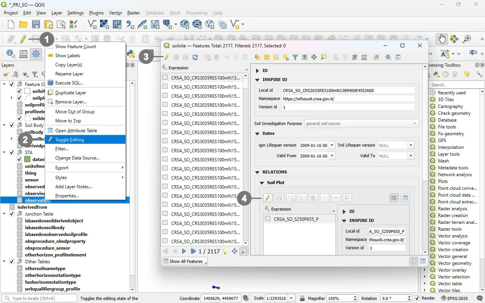
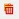

# Editing Records Through a QGIS Form

>To create or modify a record through a QGIS form, you must enable editing mode by using the  **"Toggle Editing Mode"** button. 

## Start Editing

  
This button is available both in the QGIS <strong>Digitizing toolbar</strong> ① and in the <strong>context menu</strong> of each layer ②.

In addition, the same button—along with other tools useful for editing—is also available directly <strong>inside the forms</strong> ③ and within the <strong>sub‑forms</strong> ④.  

  

This setup allows for faster and more complete editing of all elements that make up the GeoPackage.

> [!IMPORTANT]
> The **“Toggle Editing Mode”** button in the main **Digitizing** toolbar enables editing for the layer that is currently selected in the Layers panel.

## Edit mode
After the **Toggle Editing Mode** button is clicked, the form enters **editing mode**.

  
The toggle button remains in the <strong>checked (pressed) state</strong> ⑤ ⑥ to indicate that editing is enabled, and a <strong>pencil icon</strong> ⑦ appears in the <strong>Layers</strong>panel next to the layer currently being edited.

  

## Editing Operations
When editing mode is enabled, the form allows you to:

### Update existing attribute values
In QGIS, updating attribute values is done directly through the attribute form, which can be opened by selecting a feature and viewing its properties. The form allows modification of single or multiple fields, applying controls, dedicated widgets, and constraints defined in the layer’s configuration.

### Add new records
New records can be created using digitizing tools, which generate a new feature and automatically open the associated attribute form. For tables without geometry, new records are added directly through the form, with no geometric digitizing involved. The form allows filling in all fields defined by the data model, using widgets, default values, validation rules, and custom controls.

### Delete features
Deleting features in QGIS removes both the geometric element and its attributes. Once a feature is selected, it can be deleted using the **Delete Feature** tool . This operation permanently removes the record from the dataset, ensuring it is no longer displayed or referenced in subsequent operations.

> [!IMPORTANT]
> These changes **are not written to disk immediately**.
They remain in a temporary in‑memory edit buffer until you explicitly [save](./save_form.md).

> [!NOTE]
> When **deleting a record**, please be aware that the underlying database may enforce **cascade rules** that automatically remove or update related records in other tables. This can lead to additional, unintended deletions if the feature being removed participates in foreign‑key relationships or dependency chains.
You can find the complete list of cascade rules applied in the database [here](../cascade_summary.md).
