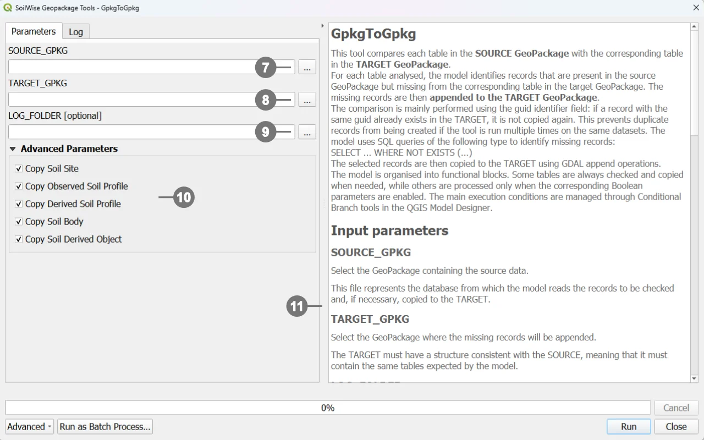

# Incremental GeoPackage Data Transfer

## Introduction

**GpkgToGpkg** is a QGIS Processing model designed to transfer data from a source GeoPackage, referred to as the **SOURCE**, to a destination GeoPackage, referred to as the **TARGET**.

During execution, the model compares the tables contained in the two GeoPackages and identifies records that are available in the SOURCE but are not yet present in the TARGET. Only the missing records are appended to the destination GeoPackage.

The comparison is primarily based on the `guid` field, which is used as a unique identifier. For some junction tables, the comparison is instead based on a combination of multiple fields. This approach allows the model to be run repeatedly on the same datasets while reducing the risk of creating duplicate records.

The model therefore performs an **incremental synchronization**:

- it appends missing records to the TARGET;
- it does not overwrite existing tables;
- it does not update records that already have the same key;
- it does not delete records from the TARGET;
- it does not modify the source GeoPackage.

The model has a modular structure. In addition to the required parameters, users can select which data groups should be transferred, choosing among Soil Sites, observed Soil Profiles, derived Soil Profiles, Soil Bodies, and Soil Derived Objects.

This selection is managed through QGIS **Conditional Branch** algorithms. Based on the enabled parameters, the model runs only the required workflow sections, including the associated descriptive tables, relationships, datastreams, and observations.

> [!IMPORTANT]
> The TARGET GeoPackage must already exist and must use a structure that is compatible with the SOURCE. In particular, it must contain the tables expected by the model.


## Opening the Model Execution Dialog

Double-click **GpkgToGpkg** in the Processing Toolbox, or click the **Run button** in the Model Designer.

<p>
    <a href="../assets/gtg_02.webp" target="_blank">
    
  </a>
QGIS opens the model execution dialog. In this dialog, specify: <br>
<br>
① The <strong>source</strong> GeoPackage. <br>
② The <strong>target</strong> GeoPackage. <br>
③ The optional <strong>log</strong> folder. <br>
④ The <strong>data groups</strong> to be copied. <br>
⑤ The right-hand side of the dialog also contains the model <strong>help</strong> panel. This panel provides a brief description of the tool and explains the purpose of the available parameters.<br>
<br>
Click the <strong>RUN</strong> button to execute the model
</p>
<br clear="all"><br> 


# Configuring the Parameters

## Main Parameters

### Source GeoPackage

The **Source GeoPackage** parameter identifies the source dataset.

This is the database from which the model reads the records that must be checked and, when necessary, copied.

The SOURCE:

- is accessed for reading;
- contains the data to be transferred;
- must include the tables expected by the model;
- is not modified by the append operations.

To set this parameter, select the source file with the `.gpkg` extension.

### Target GeoPackage

The **Target GeoPackage** parameter identifies the destination dataset.

The model compares the SOURCE tables with the corresponding TARGET tables and appends only the records that are missing from the TARGET.

The TARGET must:

- exist before the model is run;
- have a structure consistent with the SOURCE;
- contain the tables required by the model;
- be writable;
- not be locked by another application.

If a record with the same key is already present in the TARGET, it is not copied again.

> [!WARNING]
> The model does not create a complete copy of the SOURCE file and does not automatically create the full TARGET schema. Its purpose is to append missing records to a target GeoPackage that has already been prepared.

### Log Folder

The **Log Folder** parameter identifies the directory in which the execution log will be saved.

The log can be used to:

- verify the outcome of the processing operation;
- investigate errors;
- review which algorithms were executed;
- retain an audit trail of the operation;
- document processing runs involving large datasets.

If a valid folder is selected, the model saves the QGIS Processing log in that folder.

If the parameter is left empty:

- data transfer can still be performed;
- the log export workflow is not enabled;
- no log file is created in a user-selected folder.

Log export is controlled by the **LOG** conditional branch, which checks that the path is not null and is not an empty string.


## Data Selection Parameters

The following parameters allow the transfer to be restricted to specific data groups.

They can be enabled individually or in combination. The selected combination determines which sections of the model are executed.

### Copy Soil Site

The **Copy Soil Site** parameter controls the transfer of data related to Soil Sites.

#### When the parameter is enabled

The model copies:

- records from the `soilsite` table that are not already present in the TARGET;
- datastreams associated with the selected Soil Sites;
- observations linked to those datastreams.

The workflow therefore includes the Soil Site entity and its associated observational data.

#### When the parameter is disabled

The model does not copy:

- `soilsite` records;
- datastreams linked to Soil Sites;
- observations associated with those datastreams.

Disabling this parameter does not prevent other selected data groups from being processed.

### Copy Observed Soil Profile

The **Copy Observed Soil Profile** parameter controls the transfer of observed Soil Profiles.

Observed profiles are identified by the following condition:

```text
isderived = 0
```

#### When the parameter is enabled

The model copies:

- missing observed Soil Profiles;
- associated Soil Plots;
- related Profile Elements;
- associated descriptive and classification tables;
- datastreams related to profiles and profile elements;
- observations linked to those datastreams;
- relationships with Soil Derived Objects, when **Copy Soil Derived Object** is also enabled.

#### When the parameter is disabled

Profiles where `isderived = 0` are not appended to the TARGET.

Workflow sections that specifically depend on observed profiles, such as Soil Plots and some relationships with Soil Derived Objects, are also skipped.

### Copy Derived Soil Profile

The **Copy Derived Soil Profile** parameter controls the transfer of derived Soil Profiles.

Derived profiles are identified by the following condition:

```text
isderived = 1
```

#### When the parameter is enabled

The model copies:

- missing derived Soil Profiles;
- associated Profile Elements;
- related descriptive and classification tables;
- datastreams related to profiles and profile elements;
- linked observations;
- the relationship with Soil Bodies, when **Copy Soil Body** is also enabled.

#### When the parameter is disabled

Profiles where `isderived = 1` are not appended to the TARGET.

Relationships that require derived profiles are also not copied.

### Relationship Between Observed and Derived Profiles

When both of the following parameters are enabled:

- **Copy Observed Soil Profile**;
- **Copy Derived Soil Profile**;

the model also enables the transfer of the `isderivedfrom` table.

This table represents the relationship between a derived profile and the observed profile from which it was derived.

The relationship is copied only when both profile groups are selected. This prevents the TARGET from receiving a relationship that points to a profile that has not been included.

The possible combinations are therefore:

- **observed profiles only:** `isderivedfrom` is not copied;
- **derived profiles only:** `isderivedfrom` is not copied;
- **observed and derived profiles:** both groups and `isderivedfrom` are copied;
- **neither group selected:** the Soil Profile workflow is not executed.

### Copy Soil Body

The **Copy Soil Body** parameter controls the transfer of data related to Soil Bodies.

#### When the parameter is enabled

The model copies:

- records from the `soilbody` table;
- geometries stored in `soilbody_geom`;
- `derivedprofilepresenceinsoilbody`, when derived Soil Profiles are also enabled;
- `isbasedonsoilbody`, when Soil Derived Objects are also enabled.

#### When the parameter is disabled

The model does not copy:

- Soil Body records;
- their geometries;
- relationships that depend on the presence of Soil Bodies.

This parameter can be combined with **Copy Derived Soil Profile** and **Copy Soil Derived Object** to preserve relationships between the corresponding domains.

### Copy Soil Derived Object

The **Copy Soil Derived Object** parameter controls the transfer of Soil Derived Objects.

#### When the parameter is enabled

The model copies:

- records from the `soilderivedobject` table;
- associated geometries;
- records from the `isbasedonsoilderivedobject` relationship table;
- datastreams linked to Soil Derived Objects;
- observations associated with those datastreams;
- `isbasedonobservedsoilprofile`, when observed Soil Profiles are also enabled;
- `isbasedonsoilbody`, when Soil Bodies are also enabled.

#### When the parameter is disabled

The model does not copy:

- Soil Derived Objects;
- their related datastreams;
- linked observations;
- relationships that depend on the presence of Soil Derived Objects.


## Selecting Parameter Combinations

The parameters can be used independently, but some combinations preserve a more complete set of relationships.

### Soil Sites Only

Enable:

- **Copy Soil Site**

The model copies Soil Sites, related datastreams, and linked observations.

### Observed Soil Profiles Only

Enable:

- **Copy Observed Soil Profile**

The model copies profiles where `isderived = 0`, Soil Plots, and the associated descriptive and observational data.

### Derived Soil Profiles Only

Enable:

- **Copy Derived Soil Profile**

The model copies profiles where `isderived = 1` and the related data.

### Observed and Derived Soil Profiles

Enable:

- **Copy Observed Soil Profile**;
- **Copy Derived Soil Profile**.

The model copies both groups and the `isderivedfrom` relationship.

### Soil Bodies and Derived Soil Profiles

Enable:

- **Copy Soil Body**;
- **Copy Derived Soil Profile**.

The model can also copy the `derivedprofilepresenceinsoilbody` relationship.

### Soil Derived Objects and Observed Soil Profiles

Enable:

- **Copy Soil Derived Object**;
- **Copy Observed Soil Profile**.

The model can also copy the `isbasedonobservedsoilprofile` relationship.

### Soil Derived Objects and Soil Bodies

Enable:

- **Copy Soil Derived Object**;
- **Copy Soil Body**.

The model can also copy the `isbasedonsoilbody` relationship.

> [!TIP]
> To preserve all relationships between two domains, enable both relevant parameters. Otherwise, the model may omit the relationship table to avoid references to entities that are not present in the TARGET.

> [!NOTE]
>  Refer to the [model's technical documentation](./gpkg_to_gpkg_documentation.md) for a detailed explanation of its internal structure and workflow logic.

