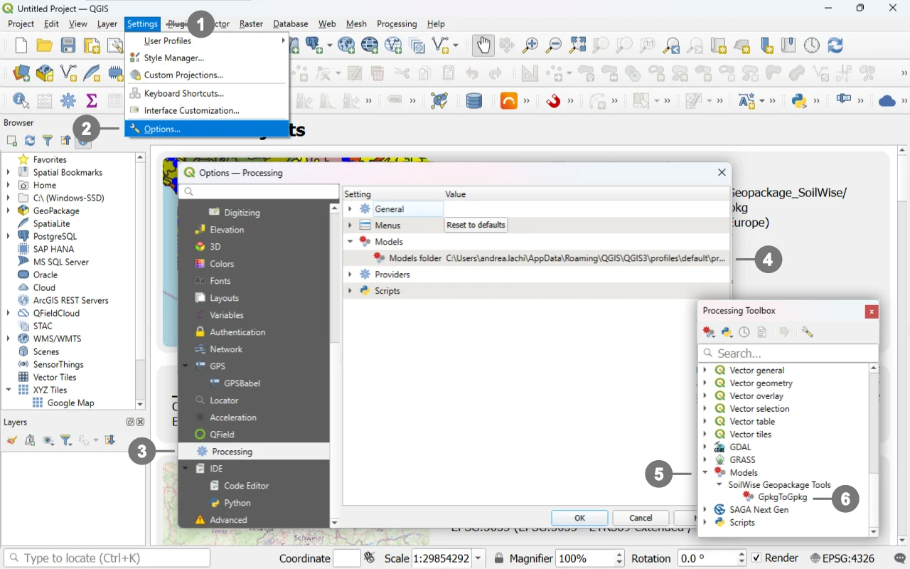
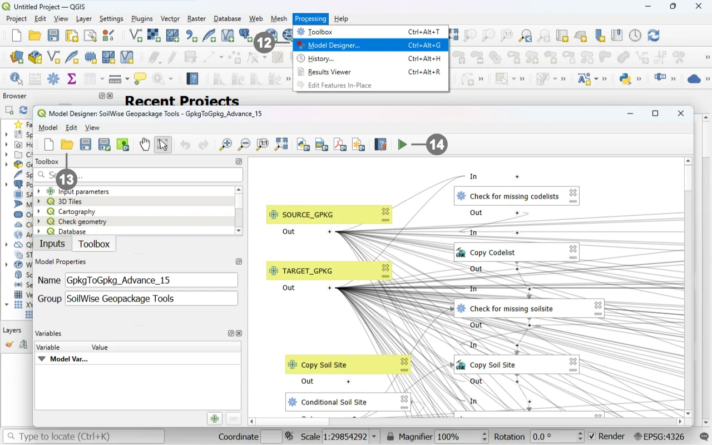

# How to Use Processing Models in QGIS

## Adding the Model to the Processing Toolbox

### Downloading the Model

Download the [model](https://github.com/soilwise-he/Geopackage-so/tree/main/geopackage/Models/) file from the GitHub repository. The file uses the following extension:

```text
.model3
```

Keep the original file extension unchanged.


### Locating the QGIS Models Folder

To avoid loading the `.model3` file manually every time the tool is required, copy it to the folder used by QGIS to store Processing models.

Follow these steps:

<p>
  <a href="../assets/gtg_01.webp" target="_blank">
    
  </a>
  
Start QGIS. <br>
<br>
① Open the <strong>Settings</strong> menu. <br>
② Select <strong>Options</strong>.<br>
In the <strong>Options</strong> dialog, select ③ <strong>Processing</strong> from the panel on the left.<br>
On the right-hand side of the dialog, expand the <strong>Models</strong> section.<br>
Locate the ④ <strong>Models folder</strong> setting.<br>
The path displayed under <strong>Models folder</strong> identifies the directory in which QGIS searches for user-installed Processing models.
</p>
<br clear="all"><br> 


Copy the downloaded `.model3` file into this folder.

> [!NOTE]
> The folder path may vary depending on the operating system, QGIS version, and active QGIS user profile. For this reason, use the path displayed in the QGIS options instead of relying on a predefined system path.


### Displaying the Model in the Processing Toolbox

After copying the file to the models folder, return to the main QGIS window.

If the **Processing Toolbox** is not visible, open it from:

**Processing → Toolbox**

In the Processing Toolbox, expand:

⑤ **Models → SoilWise Geopackage Tools**

⑥ Click the **model name** in the Processing Toolbox to open the **Model Execution Dialog**.

> [!NOTE]
> If the model does not appear immediately, refresh the Processing Toolbox or restart QGIS.


## Opening and Running the Model in the Model Designer

### When to Use the Model Designer

The model can be opened directly in the Model Designer without first installing it in the models folder.

This method is useful when you need to:

- run the model occasionally;
- inspect its structure;
- review dependencies between algorithms;
- inspect the SQL expressions;
- modify parameters;
- modify Conditional Branch algorithms;
- add or remove workflow steps;
- create a customized version of the model.

The Model Designer represents a sequence of processing algorithms as a single workflow that can later be executed with different input data.


### Opening the Model

After [downloading](https://github.com/soilwise-he/Geopackage-so/tree/main/geopackage/Models/)  the `.model3` file:

<p>
  <a href="../assets/gtg_03.webp" target="_blank">
    
  </a>
Start QGIS.<br>
<br>
Open the <strong>Processing</strong> menu. <br>
⑫ select <strong>Model Designer</strong>. <br>
⑬ in the Model Designer window, select <strong>Open Model</strong>. <br>
Use the file browser to locate the downloaded model. <br>
Select a file in `.model3`  format. <br>
Confirm the selection. <br>
⑭  Run the model.
</p>
<br clear="all"><br> 


The model is displayed in the Model Designer workspace, where the following elements are visible:

- input parameters;
- comparison algorithms;
- join operations;
- field selection operations;
- copy operations;
- dependencies between algorithms;
- Conditional Branch algorithms.


### Running the Model from the Model Designer

To run the model from the Model Designer:

1. select **Run Model** or click the **Run** button;
2. wait for the parameter dialog to open;
3. set the parameters;
4. click **Run**.

The parameter dialog is the same as the one displayed when the model is launched from the Processing Toolbox.
Running selected steps is particularly useful when developing, testing, or troubleshooting the model.


### Modifying the Model

Opening the model in the Model Designer allows any of its components to be modified, including:

- the SQL queries used to identify missing records;
- the keys used for comparisons;
- the tables included in the workflow;
- the fields retained in intermediate outputs;
- the conditions that enable individual workflow sections;
- the GDAL options used for append operations;
- dependencies between algorithms;
- parameters displayed to the user;
- the model's internal help documentation.

Before saving a modified version, it is advisable to:

1. use a different file name;
2. retain a copy of the original model;
3. validate the model;
4. test it on copies of the GeoPackages;
5. verify the referential integrity of the output.
