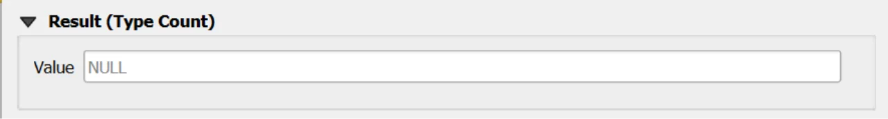
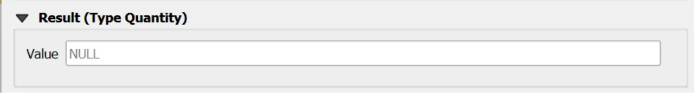
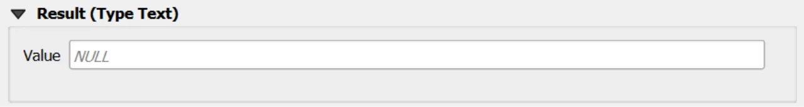

# Obseravtion Form

## Open
To open the Obseravtion custom forms, go to the Layers panel, right‑click the `observation` layer, and choose **Open Attribute Table** from the context menu.

> [!TIP]
> For further information on the custom forms, consult the documents [Customized Attribute Forms in QGIS](./custom_form.md) and [Navigating GeoPackage Tables via Forms](./navigating_via_form.md)  

> [!IMPORTANT]
>It is **strongly recommended** to create Obseravtions **through the child forms of the Datastream** rather than directly from the Observation table, as this ensures that the Observation automatically receives the correct parent keys without manual selection.

## Edit

A Observation does not contain any geometry. To enable editing through forms, follow the instructions provided in the document [Editing Records Through a QGIS Form](./edit_form.md).

### REQUIRED fields
- `id`: primary key (auto-incrementing)
- `phenomenontime_start`: DATETIME (default: today)
- `guid_datastream`: TEXT (FK)

### ID Group

  

  

#### Fields

- **`id`** - Primary **AUTO_INCREMENT INTEGER PRIMARY KEY**; it’s the required identifier for GeoPackage tables and is assigned automatically on insert.

- **`guid`** - **Global identifier** in UUID format, stored as text. The field is **optional**. It's **automatically managed via triggers**.

> [!IMPORTANT]
> On opening, the **ID** group is collapsed: there is no need for manual editing, as **both fields are system‑managed** (the `id` by the SQLite engine and the `guid` by triggers), reducing errors and ensuring identifier consistency over time.

### Value

The custom form displays **only the appropriate Value control** based on the selection made in the **parent Datastream**.  
This ensures users can enter a value that matches the Datastream’s configured **Result Type** and related constraints.

#### UI-Level Behavior (Custom Form)
- The form is **type-aware**: it shows only the **correct Value input** according to the parent Datastream’s configuration.
- Incompatible inputs are **hidden or disabled**, preventing invalid entries at the source.

> [!IMPORTANT]
>The same validation is enforced by the **database engine**.  
Only values of the **correct type**—as defined in the parent Datastream—can be persisted.  
This guarantees integrity even if records are inserted or modified **outside the form** (e.g., direct table edits or batch operations).

#### Result Type: Boolean

**value of type True/False**  
Represent binary values (true/false).

  

  

#### Result Type: Category

**value of type Text**  
Represent categorical or classified values defined within a controlled code list.

Only codes that are valid for the **codespace** selected in the Datastream appear in the dropdown list. 

  

  

> [!IMPORTANT]
>  For further information about codespaces and instructions on how to add them to the geopackage, please refer to the [documentation](../tables/codelist.md) of the **Codelist** table.

#### Result Type: Count

**value of type Real**  
Used to represent integer counts or occurrences.

  

  

If range limits are defined in the parent Datastream:
- When **both `value_min` and `value_max`** are present, the Value **must fall within the inclusive range**:
  - `value_min ≤ value ≤ value_max`
- When only **one bound** is defined, the respective bound is enforced:
  - If only `value_min` is set → `value ≥ value_min`
  - If only `value_max` is set → `value ≤ value_max`

If **no bounds** are specified in the Datastream, **any value of the correct type** is accepted.

#### Result Type: Quantity

**value of type Real**  
Used to represent measurable quantities associated with a numeric value and a unit of measure.

  

  

If range limits are defined in the parent Datastream:
- When **both `value_min` and `value_max`** are present, the Value **must fall within the inclusive range**:
  - `value_min ≤ value ≤ value_max`
- When only **one bound** is defined, the respective bound is enforced:
  - If only `value_min` is set → `value ≥ value_min`
  - If only `value_max` is set → `value ≤ value_max`

If **no bounds** are specified in the Datastream, **any value of the correct type** is accepted.

#### Result Type: Text

**value of type Text**  
Used to represent free-text or descriptive values.

  

  

> [!IMPORTANT]
>Only values of the **correct type**—as defined in the parent Datastream—can be persisted.  
This guarantees integrity even if records are inserted or modified **outside the form** (e.g., direct table edits or batch operations).

### Constraints
- **Valid time order**: `validtime_end > validtime_start` when both provided (CHECK).
- **Type-shape enforcement**: BEFORE INSERT/UPDATE triggers validate `result_*` per parent datastream `type`, including NULLability, boolean domain, integer requirement for `Count`, and compliance with `value_min/max` where defined.
- **Category membership**: when parent datastream type is `Category`, `result_text` must exist in `codelist(id)` for that datastream `codespace` (BEFORE INSERT/UPDATE).
- **Datastream time window maintenance**: AFTER triggers recalculate the parent datastream `phenomenontime_*` after INSERT/UPDATE/DELETE.

### Attribute Reference
For an  overview of the **attributes used in the custom form**, refer to the soilsite table  [documentation](../tables/observation.md). It provides the key definitions and data types needed to correctly interpret the fields and configure the form within the data model.

## Save

For a more comprehensive overview of form‑saving workflows, refer to the detailed documentation in [Saving Edits in QGIS Forms](./save_form.md).
