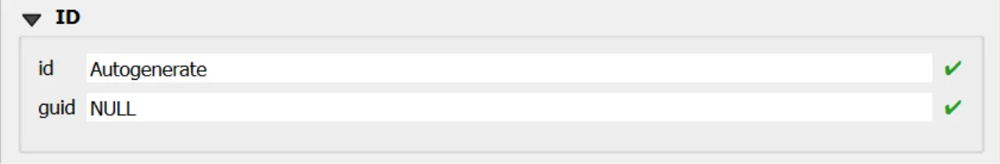

# Profile Element Form

## Open
To open the Profile Element custom forms, go to the Layers panel, right‑click the `profileelement` layer, and choose **Open Attribute Table** from the context menu.

> [!TIP]
> For further information on the custom forms, consult the documents [Customized Attribute Forms in QGIS](./custom_form.md) and [Navigating GeoPackage Tables via Forms](./navigating_via_form.md)  

## Edit

A Profile Element does not contain any geometry. To enable editing through forms, follow the instructions provided in the document [Editing Records Through a QGIS Form](./edit_form.md).

### REQUIRED fields
- `id`: primary key (auto-incrementing)
- `Begin Lifespan version`: DATETIME (default: today)
- `profileelementtype`: BOOLEAN (default: 0)
- `ispartof`: TEXT (FK to soilprofile.guid)
- `Depth range`: at least one of upper/lower value must be NOT NULL (rule)

### ID Group

  

  

#### Fields

- **`id`** - Primary **AUTO_INCREMENT INTEGER PRIMARY KEY**; it’s the required identifier for GeoPackage tables and is assigned automatically on insert.

- **`guid`** - **Global identifier** in UUID format, stored as text. The field is **optional**. It's **automatically managed via triggers**.

> [!IMPORTANT]
> On opening, the **ID** group is collapsed: there is no need for manual editing, as **both fields are system‑managed** (the `id` by the SQLite engine and the `guid` by triggers), reducing errors and ensuring identifier consistency over time.

### Dynamic Form Behaviour Based on `Is a Layer`

>In the INSPIRE *Soil* model, *Profile Element* is an abstract type that groups the vertical slices composing a soil profile; it specialises into **Soil Horizon** and **Soil Layer**. A **Soil Horizon** is a pedogenetically formed, relatively homogeneous layer (roughly parallel to the surface) identified by morphological/analytical characteristics. A **Soil Layer** is an arbitrary (often depth‑based) slice or a grouping of horizons, not necessarily reflecting pedogenic boundaries.[^1]

The **Profile Element** data-entry form adapts dynamically based on the value of profileelementtype, which determines whether the profile element is a **Soil Horizon** (`0`) or a **Soil Layer** (`1`). This behaviour follows the INSPIRE Soil data model and is strictly enforced in the GeoPackage by database triggers and CHECK constraints.

[^1]: European Commission – Joint Research Centre (JRC),  
**INSPIRE Data Specification on Soil – Technical Guidelines**,  
D2.8.III.3.  
https://inspire-mif.github.io/technical-guidelines/data/so/dataspecification_so.pdf

#### `Is a Layer = 0` → **Horizon**

  
When users select <strong>Horizon</strong> -  <strong>The checkbox is unchecked</strong> ①
  
The sections <strong>FAO Horizon Notation Type</strong> ② and <strong>Other Horizon Notation Type</strong> ③ are <strong>visible</strong>.

The section <strong>Layer Parameter</strong> is <strong>hidden</strong> (layer‑only attributes are not applicable and are rejected by triggers if present).

  

#### `Is a Layer = 1` → **Layer**

  
When users select <strong>Layer</strong> - <strong>The checkbox is checked</strong> ①
  
The section <strong>Layer Parameter</strong> ② is <strong>visible</strong> (for `layertype`, `layerrocktype`, `layergenesisprocess`, `layergenesisenviroment`, `layergenesisprocessstate`).
  
The sections <strong>FAO Horizon Notation Type</strong> and <strong>Other Horizon Notation Type</strong> are <strong>hidden</strong> (notation applies to Horizons only and is blocked by triggers for Layers).

  

### INSPIRE ID Group

  

  

>An **INSPIRE ID** is the **external unique identifier** assigned to each spatial object in INSPIRE datasets; it ensures **uniqueness** and **persistence** and allows external applications to reliably reference the same object over time.
The identifier **must not be changed** during the object’s life cycle; it can also be published as a **URI** to facilitate web-based referencing. [^2]

[^2]: Creating INSPIRE external unique object identifiers in the scope of the END reporting.
https://epanet.eea.europa.eu/Eionet/reportnet/docs/noise/guidelines/inspire_identifiers_doc.pdf 

#### Fields

- **`Local id`** — Local identifier assigned by the data provider; **unique** within its namespace.
- **`Namespace`** — Namespace that uniquely identifies the data source/domain of the spatial object. 
- **`Version id`** — Identifier of the specific **version** of the object; **optional (voidable)** and used to distinguish different versions of the same object. 

> [!IMPORTANT]
> These fields are not mandatory, but **filling them out is strongly recommended**: they help uniquely identify the record in forms and across data exchanges.  
> In particular, `localid` + `namespace` form a stable identifier; `versionid` helps track changes over time.

### Editing Child Elements in QGIS Forms
Editing child elements directly within a parent form improves data quality and speed: it keeps users in context, guarantees referential integrity through predefined relations, and reduces errors by enforcing database rules at the moment of entry. In your GeoPackage, several relationships are validated by triggers and codelist checks, so capturing child data where it belongs (inside the parent form) closely aligns UI behavior with DB constraints.

### Sub Form 

  

  

Use the following buttons to manage child layers during data editing.
  
**Toggle editing mode for child layer** ① enables editing on the related (child) layer embedded in the form; once active, you can add/modify/delete child records directly from the parent record’s view.

**Save child layer edit** ② commits the pending edits for the child layer to the GeoPackage. Use this to persist changes without leaving the parent form.

**Add child feature** ③ creates a new child record pre‑linked to the current parent (relation fields are auto‑populated by the form’s relation widget), ensuring correct foreign keys and preventing orphan rows.

### Sub Form FAO Horizon Notation Type (*Visible if `Is a Layer` = FALSE*)
**Purpose**: encodes the FAO horizon notation for a Horizon (one record per horizon via the unique guid_profileelement), including master horizons, subordinate designations, discontinuities, vertical suffix, and prime.

**DB enforcement**: allowed only when the linked profileelement is a Horizon (profileelementtype = 0); codelist membership checks on faohorizonmaster_1/2, faohorizonsubordinate_1..3 (with sequencing of 2→requires 1, 3→requires 2), and faoprime; GUID auto‑generation and immutability; guid_profileelement is UNIQUE; FK to profileelement with CASCADE on delete/update. 

**Form hint**: present as a child panel inside the Profile Element form when Is a Layer = No (Horizon); hidden for Layer; saving commits a single FAO notation per horizon and applies all trigger/codelist checks. 

### Sub Form Other Horizon Notation Type (*Visible if `Is a Layer` = FALSE*)
**Purpose**: links Horizon elements to Other Horizon Notation records (N:M association between profileelement and otherhorizonnotationtype) to capture alternative notation systems.

**DB enforcement**: association permitted only if the target profileelement is a Horizon (profileelementtype = 0); pair (guid_profileelement, guid_otherhorizonnotationtype) is UNIQUE; FKs to both tables with CASCADE; the target notation table enforces codelist membership for horizonnotation.

**Form hint**: present as a child list in the Profile Element (Horizon) form; hidden for Layer; use Add child feature to add links to additional notations and Save child layer edit to persist.

### Constraints
- **CHECK (depth range)**: at least one of `profileelementdepthrange_uppervalue` / `..._lowervalue` must be NOT NULL (BEFORE INSERT/UPDATE).
- **CHECK (range order)**: `uppervalue < lowervalue` enforced via BEFORE INSERT/UPDATE triggers.
- **CHECK (version)**: `beginlifespanversion <= endlifespanversion` (BEFORE INSERT).
- **Geogenic consistency**: when `layertype` is not `geogenic`, geogenic attributes must be NULL (BEFORE INSERT/UPDATE).
- **Horizon vs Layer fields**: when `profileelementtype = HORIZON`, layer-specific attributes must be NULL (BEFORE INSERT/UPDATE).
- **Codelists**: membership checks for `layertype`, `layerrocktype`, `layergenesisprocess`, `layergenesisenviroment`, `layergenesisprocessstate` (BEFORE INSERT/UPDATE).
- **GUID immutability** and **versioning refresh** on UPDATE.

### Attribute Reference
For an  overview of the **attributes used in the custom form**, refer to the soilsite table  [documentation](../tables/profileelement.md). It provides the key definitions and data types needed to correctly interpret the fields and configure the form within the data model.

## Save

For a more comprehensive overview of form‑saving workflows, refer to the detailed documentation in [Saving Edits in QGIS Forms](./save_form.md).
