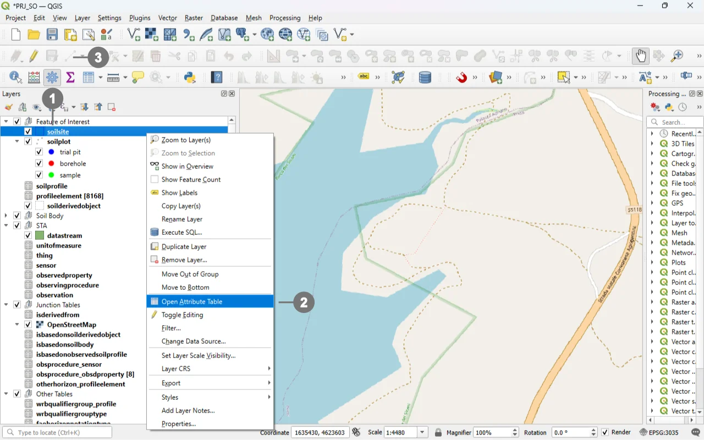
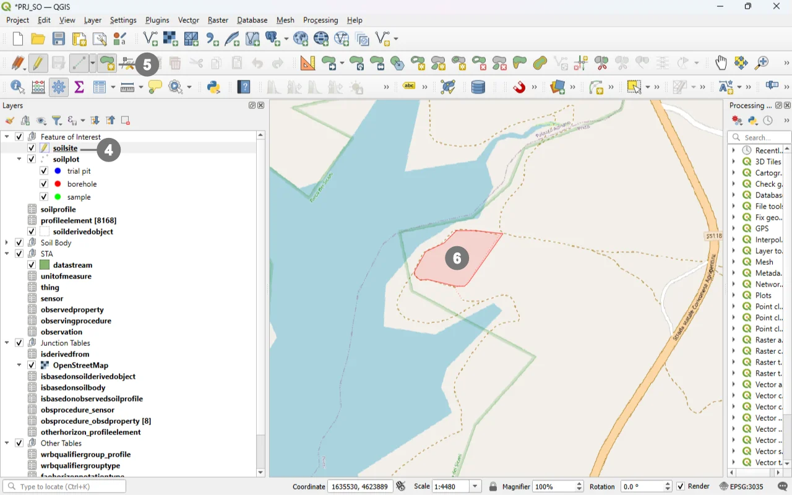

# Soil Site Forms

## Open
To open the Soil Site custom forms, go to the Layers panel, right‑click the `soilsite` layer, and choose **Open Attribute Table** from the context menu.

> [!TIP]
> For further information on the custom forms, consult the documents [Customized Attribute Forms in QGIS](./custom_form.md) and [Navigating GeoPackage Tables via Forms](./navigating_via_form.md)  

## Edit

The "Soil Site" it's a **polygonal geographic entity**. The first step To create a new Soil Site feature is to define its geometry.

  
Right-click in the "Layers" panel on the "soilsite", ① and from the menu, select "Toggle Editing" ②.
  
Alternatively, select only the “Soil Site” layer ① and click the “Toggle Editing” button ③ in the toolbar.

  

  
A small pencil icon ④ will appear, indicating that the feature is in edit mode.
  
In the toolbar, select the "Add Polygon Feature" icon ⑤ and draw the geometry of the new "Soil Site". ⑥

  

  
Right-click to close the geometry, and the data entry form will appear. ⑦

Use the widgets provided by the form to modify data.

  

For detailed information on how to initiate edit mode for a custom form, refer to the [Editing Records Through a QGIS Form](./edit_form.md) documentation.

### ID Group

  

  

#### Fields

- **`id`** - Primary **AUTO_INCREMENT INTEGER PRIMARY KEY**; it’s the required identifier for GeoPackage tables and is assigned automatically on insert.

- **`guid`** - **Global identifier** in UUID format, stored as text. The field is **optional**. It's **automatically managed via triggers**.

> [!IMPORTANT]
> On opening, the **ID** group is collapsed: there is no need for manual editing, as **both fields are system‑managed** (the `id` by the SQLite engine and the `guid` by triggers), reducing errors and ensuring identifier consistency over time.

### INSPIRE ID Group

  

  

>An **INSPIRE ID** is the **external unique identifier** assigned to each spatial object in INSPIRE datasets; it ensures **uniqueness** and **persistence** and allows external applications to reliably reference the same object over time.
The identifier **must not be changed** during the object’s life cycle; it can also be published as a **URI** to facilitate web-based referencing. [^1]

[^1]: Creating INSPIRE external unique object identifiers in the scope of the END reporting.
https://epanet.eea.europa.eu/Eionet/reportnet/docs/noise/guidelines/inspire_identifiers_doc.pdf 

#### Fields

- **`Local id`** — Local identifier assigned by the data provider; **unique** within its namespace.
- **`Namespace`** — Namespace that uniquely identifies the data source/domain of the spatial object. 
- **`Version id`** — Identifier of the specific **version** of the object; **optional (voidable)** and used to distinguish different versions of the same object. 

> [!IMPORTANT]
> These fields are not mandatory, but **filling them out is strongly recommended**: they help uniquely identify the record in forms and across data exchanges.  
> In particular, `localid` + `namespace` form a stable identifier; `versionid` helps track changes over time.

### REQUIRED fields

- `id`: primary key (auto-incrementing)
- **`geometry`**: POLYGON (manual editing)
- **`Soil Investigation Purpose`**: TEXT (Codelist)
- **`Valid From`**: DATETIME (DEFAULT: Today)
- **`Begin Lifespan version`**: DATETIME (DEFAULT: Today)

### Attribute Reference
For a more in‑depth and comprehensive understanding of the attributes exposed within the custom form, it is recommended to consult the [documentation](../tables/soilsite.md) associated with the soilsite table. This reference provides detailed descriptions of each attribute, including their purpose, data types, and their role within the broader data model. Reviewing this information can help ensure correct data interpretation and proper form configuration, especially when implementing advanced validation rules or integrating the form into more complex editing workflows.

## Save

For a more comprehensive overview of form‑saving workflows, refer to the detailed documentation in [Saving Edits in QGIS Forms](./save_form.md).
