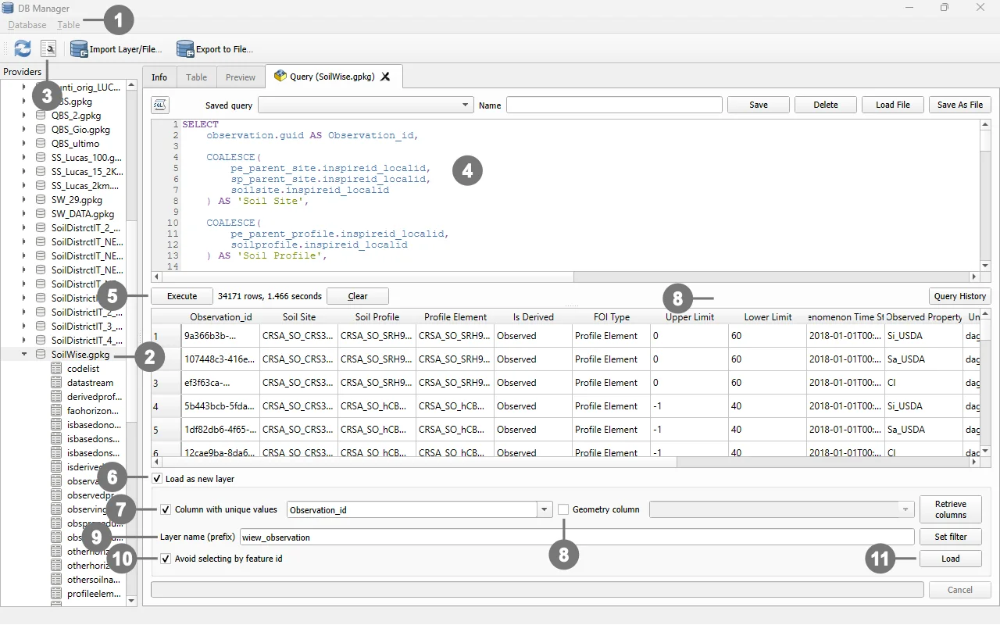

# Observation View

## Purpose

`view_observation` presents observations in a **wide format**, where each observation occupies a single row and the related information is exposed through thematic columns. This format simplifies data browsing in QGIS, data export, and report generation, without requiring users to manually reconstruct the relationships between the normalized source tables.

The query starts from the `observation` table and enriches each record with:

- the Feature of Interest associated with the datastream;
- the identifiers of the Soil Site, Soil Profile, and Profile Element;
- the hierarchical traversal from Profile Element to Soil Profile and Soil Site;
- the `Derived` or `Observed` classification of the relevant profile;
- the depth interval of the Profile Element;
- the observed property, unit of measure, and observing procedure;
- categorical, Boolean, quantity, and count results.

## Nature of the View in the QGIS Project

> [!IMPORTANT]
> In the QGIS project, `view_observation` is not a persistent database view stored in the GeoPackage or database schema. It is a **query-based layer** whose `SELECT` statement is stored in the QGIS project configuration.

Consequently:

- the query does not modify the data schema;
- no `VIEW` object is automatically created in the database;
- the layer depends on the source tables and relationships referenced by the query;
- to distribute the layer correctly, the QGIS project containing its definition must also be distributed, unless the query is recreated in another project.

The term *view* is therefore used in a functional sense, because the layer provides a derived representation of the data. From a technical perspective, however, it is a SQL query layer within the QGIS project.

## Data Refresh Behaviour

The query does not materialize or copy its results into the project. Whenever QGIS loads the `view_observation` layer, the data provider executes the `SELECT` statement again against the source tables.

When the project is opened, the layer is reloaded, or its data source is refreshed, the displayed content is recalculated from the data currently stored in the GeoPackage or database.

This behaviour means that:

- newly inserted observations become available without manually regenerating an output table;
- changes to existing records are reflected the next time the layer is loaded or refreshed;
- records deleted from the source tables no longer appear in the result;
- query performance depends on data volume, available indexes, and join complexity.

> [!NOTE]
> If the layer is already open, changes made through another application or database connection may require the QGIS **Reload** or **Refresh** command. Reopening the project also forces the layer to be loaded again.

## Result Structure

Each row returned by the query corresponds to one record in the `observation` table.

| Column | Source or calculation | Description |
| --- | --- | --- |
| `Observation_id` | `observation.guid` | Unique observation identifier used by QGIS as the unique-value column for the query layer. |
| `Soil Site` | `COALESCE` among the site resolved from the Profile Element, the site resolved from the Soil Profile, and the directly linked site | Local identifier of the Soil Site associated with the observation. |
| `Soil Profile` | `COALESCE` between the parent profile of the Profile Element and the directly linked profile | Local identifier of the Soil Profile associated with the observation. |
| `Profile Element` | `profileelement.inspireid_localid` | Local identifier of the Profile Element directly associated with the datastream. |
| `Is Derived` | `CASE` expression based on the relevant profile's `isderived` value | Returns `Derived`, `Observed`, or `NULL`. |
| `FOI Type` | `CASE` expression based on the datastream FOI foreign keys | Feature of Interest type: `Profile Element`, `Soil Profile`, `Soil Site`, `Soil Derived Object`, or `None`. |
| `Upper Limit` | `profileelementdepthrange_uppervalue` | Upper limit of the Profile Element depth interval. |
| `Lower Limit` | `profileelementdepthrange_lowervalue` | Lower limit of the Profile Element depth interval. |
| `Phenomenon Time Start` | `observation.phenomenontime_start` | Start date and time of the observed phenomenon. |
| `Observed Property` | `observedproperty.name` | Name of the property being observed. |
| `Unit Of Measure` | `unitofmeasure.symbol` | Unit-of-measure symbol, when available. |
| `Observing Procedure` | `observingprocedure.name` | Name of the procedure used to produce the observation. |
| `Category Value` | `observation.result_text` | Textual or categorical observation result. |
| `Boolean Value` | `observation.result_boolean` | Boolean observation result. |
| `Quantity Value` | `observation.result_real` when `datastream.type = 'Quantity'` | Numeric value for observations belonging to Quantity datastreams. |
| `Count Value` | `observation.result_real` when `datastream.type = 'Count'` | Numeric value for observations belonging to Count datastreams. |

Fields that are not applicable to the observation type or Feature of Interest are returned as `NULL`.

## Relationship Logic

### Direct Features of Interest

A `datastream` may refer directly to one of the following entities:

- `soilsite`;
- `soilprofile`;
- `profileelement`;
- `soilderivedobject`.

The `FOI Type` column identifies the linked entity type by checking which `guid_*` foreign key is populated in the datastream.

### Hierarchical Traversal

When the Feature of Interest is a `Profile Element`, the query traverses the hierarchy as follows:

```text
Profile Element
    -> Soil Profile
        -> Soil Plot
            -> Soil Site
```

When the Feature of Interest is a `Soil Profile`, the hierarchy is traversed as follows:

```text
Soil Profile
    -> Soil Plot
        -> Soil Site
```

The `COALESCE` function returns the first available non-null identifier. This allows the `Soil Site` and `Soil Profile` columns to be populated both for direct relationships and for relationships resolved through the hierarchy.

### Derived/Observed Classification

The `Is Derived` column is calculated only when the datastream is associated with a `Profile Element` or a `Soil Profile`:

- for a `Profile Element`, the `isderived` value is read from its parent Soil Profile;
- for a `Soil Profile`, the `isderived` value is read from the directly associated profile;
- `1` is mapped to `Derived`;
- `0` is mapped to `Observed`;
- in all other cases, the result is `NULL`.

### Separation of Numeric Results

The value stored in `observation.result_real` is exposed through two separate output columns:

- `Quantity Value`, only for datastreams of type `Quantity`;
- `Count Value`, only for datastreams of type `Count`.

This separation improves readability and export usability while preserving the normalized structure of the source tables.

## SQL Query Used in the QGIS Project

The following statement is the `SELECT` query associated with the `view_observation` layer. It does not include `CREATE VIEW`, because QGIS loads its result as a query-based layer.

```sql
SELECT
    ------------------------------------------------------------------
    -- Unique observation identifier used by QGIS
    ------------------------------------------------------------------
    observation.guid AS "Observation_id",

    ------------------------------------------------------------------
    -- Parent entities, resolved through soilplot where required
    ------------------------------------------------------------------
    COALESCE(
        pe_parent_site.inspireid_localid,
        sp_parent_site.inspireid_localid,
        soilsite.inspireid_localid
    ) AS "Soil Site",

    COALESCE(
        pe_parent_profile.inspireid_localid,
        soilprofile.inspireid_localid
    ) AS "Soil Profile",

    profileelement.inspireid_localid AS "Profile Element",

    ------------------------------------------------------------------
    -- Derived/Observed classification
    ------------------------------------------------------------------
    CASE
        WHEN datastream.guid_profileelement IS NOT NULL THEN
            CASE pe_parent_profile.isderived
                WHEN 1 THEN 'Derived'
                WHEN 0 THEN 'Observed'
                ELSE NULL
            END

        WHEN datastream.guid_soilprofile IS NOT NULL THEN
            CASE soilprofile.isderived
                WHEN 1 THEN 'Derived'
                WHEN 0 THEN 'Observed'
                ELSE NULL
            END

        ELSE NULL
    END AS "Is Derived",

    ------------------------------------------------------------------
    -- Feature of Interest type
    ------------------------------------------------------------------
    CASE
        WHEN datastream.guid_profileelement IS NOT NULL
            THEN 'Profile Element'

        WHEN datastream.guid_soilprofile IS NOT NULL
            THEN 'Soil Profile'

        WHEN datastream.guid_soilsite IS NOT NULL
            THEN 'Soil Site'

        WHEN datastream.guid_soilderivedobject IS NOT NULL
            THEN 'Soil Derived Object'

        ELSE 'None'
    END AS "FOI Type",

    ------------------------------------------------------------------
    -- Depth fields, applicable to Profile Elements only
    ------------------------------------------------------------------
    profileelement.profileelementdepthrange_uppervalue AS "Upper Limit",
    profileelement.profileelementdepthrange_lowervalue AS "Lower Limit",

    ------------------------------------------------------------------
    -- Observation information
    ------------------------------------------------------------------
    observation.phenomenontime_start AS "Phenomenon Time Start",

    ------------------------------------------------------------------
    -- Observed property
    ------------------------------------------------------------------
    observedproperty.name AS "Observed Property",

    ------------------------------------------------------------------
    -- Unit of measure
    ------------------------------------------------------------------
    unitofmeasure.symbol AS "Unit Of Measure",

    ------------------------------------------------------------------
    -- Observing procedure
    ------------------------------------------------------------------
    observingprocedure.name AS "Observing Procedure",

    ------------------------------------------------------------------
    -- Categorical and Boolean results
    ------------------------------------------------------------------
    observation.result_text AS "Category Value",
    observation.result_boolean AS "Boolean Value",

    ------------------------------------------------------------------
    -- Numeric value for Quantity observations
    ------------------------------------------------------------------
    CASE
        WHEN datastream.type = 'Quantity'
            THEN observation.result_real
        ELSE NULL
    END AS "Quantity Value",

    ------------------------------------------------------------------
    -- Numeric value for Count observations
    ------------------------------------------------------------------
    CASE
        WHEN datastream.type = 'Count'
            THEN observation.result_real
        ELSE NULL
    END AS "Count Value"

FROM observation

------------------------------------------------------------------
-- Datastream associated with the observation
------------------------------------------------------------------
JOIN datastream
    ON observation.guid_datastream = datastream.guid

------------------------------------------------------------------
-- Observed property
------------------------------------------------------------------
JOIN observedproperty
    ON datastream.guid_observedproperty = observedproperty.guid

------------------------------------------------------------------
-- Unit of measure
-- Normally available only for Quantity datastreams
------------------------------------------------------------------
LEFT JOIN unitofmeasure
    ON datastream.code_unitofmeasure = unitofmeasure.code

------------------------------------------------------------------
-- Observing procedure
------------------------------------------------------------------
LEFT JOIN observingprocedure
    ON datastream.guid_observingprocedure = observingprocedure.guid

------------------------------------------------------------------
-- Direct Features of Interest
------------------------------------------------------------------
LEFT JOIN soilsite
    ON datastream.guid_soilsite = soilsite.guid

LEFT JOIN soilprofile
    ON datastream.guid_soilprofile = soilprofile.guid

LEFT JOIN profileelement
    ON datastream.guid_profileelement = profileelement.guid

LEFT JOIN soilderivedobject
    ON datastream.guid_soilderivedobject = soilderivedobject.guid

------------------------------------------------------------------
-- Profile Element parent: Soil Profile
------------------------------------------------------------------
LEFT JOIN soilprofile AS pe_parent_profile
    ON profileelement.ispartof = pe_parent_profile.guid

------------------------------------------------------------------
-- Soil Profile parent: Soil Plot
------------------------------------------------------------------
LEFT JOIN soilplot AS pe_parent_plot
    ON pe_parent_profile.location = pe_parent_plot.guid

LEFT JOIN soilplot AS sp_parent_plot
    ON soilprofile.location = sp_parent_plot.guid

------------------------------------------------------------------
-- Soil Plot parent: Soil Site
------------------------------------------------------------------
LEFT JOIN soilsite AS pe_parent_site
    ON pe_parent_plot.locatedon = pe_parent_site.guid

LEFT JOIN soilsite AS sp_parent_site
    ON sp_parent_plot.locatedon = sp_parent_site.guid
```

> [!NOTE]
> Column aliases containing spaces are enclosed in double quotation marks. This ensures that they are interpreted correctly as SQL identifiers and improves SQL standards compliance.

## Adding a View to a QGIS Project with DB Manager

The following procedure adds the query to a QGIS project without creating a persistent view in the database.

Open the QGIS project.
If necessary, verify that the GeoPackage or database connection is available in the **Browser** panel.

<p>
  
① Open <strong>Database > DB Manager</strong>. <br>
② In the left-hand panel, locate and open the GeoPackage or database connection containing the source tables.<br>
Select the database and ③ open <strong>SQL Window</strong> .<br>
④ Paste the `SELECT` statement that you want to use to create the layer.<br>
⑤ Execute the query to verify that it completes without errors and returns one row per observation.<br>
⑥ Enable <strong>Load as new layer</strong>.<br>
⑦ Select the unique identifier column under <strong>Column with unique values</strong>.<br>
⑧ Do not specify a geometry column, because this query returns a non-spatial attribute layer.<br>
⑨ Set the name of the new layer you want to create.<br>
⑩ Enable <strong>Avoid selecting by feature id</strong>.<br>
⑩ Load the result into the QGIS project.<br>
Save the QGIS project so that the query and layer definition are stored in the project file.
</p>
<br clear="all"><br> 


> [!NOTE]
> Command names may vary slightly depending on the QGIS version and the user-interface language.


## Creating a Persistent View Through a DBMS

The same SQL logic can also be used directly in a database management system. In this case, the `SELECT` statement must be preceded by `CREATE VIEW`:

```sql
CREATE VIEW view_observation AS
SELECT
    -- Use the same column list and JOIN clauses as the QGIS query
    ...
;
```

To drop and recreate the view:

```sql
DROP VIEW IF EXISTS view_observation;

CREATE VIEW view_observation AS
SELECT
    -- Use the same column list and JOIN clauses as the QGIS query
    ...
;
```

When implemented as a persistent database view:

- the view definition is stored in the database;
- any authorized client can query it;
- the results remain dynamic and are computed from current source data whenever the view is queried;
- QGIS can connect directly to the view as a regular database object.

## QGIS SQL Layer Compared with a Persistent DBMS View

| Aspect | SQL layer in the QGIS project | Persistent view in the DBMS |
| --- | --- | --- |
| Definition location | QGIS project file | Database |
| Data-schema modification | No | Yes, a `VIEW` object is created |
| Result refresh | Whenever the layer is loaded or refreshed | Whenever the view is queried |
| Availability | Within the QGIS project containing the query | To all authorized database clients |
| Portability | Requires the project or manual layer recreation | Requires access to the database |
| View-creation privileges | Not required | Generally required |

