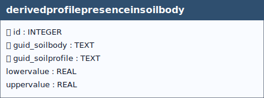

# Derived Profile Presence In Soilbody

## Definition

> *The **`derivedprofilepresenceinsoilbody`** table defines a **many-to-many** relationship between soil profiles and soil bodies, linking the `soilprofile` and `soilbody` tables. This relationship allows a soil profile to be associated with one or more soil bodies and, conversely, enables a single soil body to include multiple soil profiles. The table also stores information on the relative presence of each derived soil profile within a soil body, expressed as a range of percentages (lower and upper boundaries). When a soil body is characterized by more than one derived profile, the spatial distribution of these profiles is not explicitly defined; instead, their contribution is described through percentage ranges indicating their share in the overall soil body.*

&nbsp;

  
 <!--
  <strong>TABELLA SOILSITE EXP</strong> 
   Lorem Ipsum.
 -->

 

## Table: `derivedprofilepresenceinsoilbody`

### Columns

| Name | Type | Constraints | Description |
|------|------|-------------|-------------|
| `id` | `INTEGER` | PRIMARY KEY | Primary Key of the Table. |
| `guid_soilbody` | `TEXT` | NOT NULL | Foreign key to the SoilBody table. |
| `guid_soilprofile` | `TEXT` | NOT NULL | Foreign key to the SoilProfile table, guid field. |
| `lowervalue` | `REAL` |  | Upper value. |
| `uppervalue` | `REAL` |  | Lower value. |

### Relationships (as child)
- `derivedprofilepresenceinsoilbody.guid_soilprofile` → `soilprofile.guid` (**ON UPDATE** CASCADE, **ON DELETE** CASCADE)
  - *Note:* delete on `soilprofile` cascades to `derivedprofilepresenceinsoilbody`.
- `derivedprofilepresenceinsoilbody.guid_soilbody` → `soilbody.guid` (**ON UPDATE** CASCADE, **ON DELETE** CASCADE)
  - *Note:* delete on `soilbody` cascades to `derivedprofilepresenceinsoilbody`.

### Referenced by (as parent)
- None

### Indexes

| Name | Unique | Columns | Origin | Partial |
|------|--------|---------|--------|---------|
| `sqlite_autoindex_derivedprofilepresenceinsoilbody_1` | Yes | `guid_soilbody`, `guid_soilprofile` | `u` | No |

### Triggers
For every trigger you will find:

- **When it runs** (BEFORE/AFTER, INSERT/UPDATE/DELETE)
- **What it reads and compares** (columns, lookups in other tables)
- **What happens on success** (the statement proceeds, optional updates)
- **What happens on failure** (the exact error text raised)

 

#### `i_cecklowervaluesum` / `u_cecklowervaluesum`
**When they run:** BEFORE INSERT / BEFORE UPDATE

**What they do:** For the same `guid_soilbody`, compute the cumulative `lowervalue` across existing rows. On insert, it evaluates `SUM(lowervalue) + NEW.lowervalue`; on update, it evaluates `SUM(lowervalue) - OLD.lowervalue + NEW.lowervalue`. The total must be **≤ 100.00**.

**If the check passes:** Statement proceeds.

**If the check fails:** Aborts with: `Table derivedprofilepresenceinsoilbody: sum of lowervalue exceeds 100 for the same guid_soilbody`.

#### `i_checkisderived_soilbody` / `u_checkisderived_soilbody`
**When they run:** BEFORE INSERT / BEFORE UPDATE

**What they do:** Ensure `guid_soilprofile` references a **DERIVED** profile (`isderived = 1`).

**If the check passes:** Statement proceeds.

**If the check fails:** Aborts with: `Table derivedprofilepresenceinsoilbody: Attention, the value of the "guid_soilprofile" field cannot be inserted because profile is not of type derived`.

---

