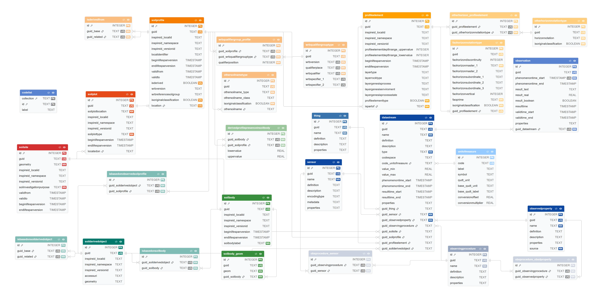

# SoilWise Geopackage-so (SQLite3) — Tables & Schema Overview

This folder documents the **database tables** of the *SoilWise INSPIRE Soil (SO) GeoPackage*, delivered as an **OGC GeoPackage** implemented on top of **SQLite3**. [^1]
The schema combines:

- an INSPIRE Soil–oriented relational core (Site → Plot → Profile → Profile Elements), and a **SensorThings-like** observation layer (Datastream/Observation) to publish soil observations as interoperable time series (aligned with the repository scope and STA 2.0 draft direction). [^2]

This page provides a **technical entry point**: how the schema is organised, which entities are central, and which integrity constraints and triggers are enforced.

[^1]: [**SoilWIise Geopackage Documentation**.](https://github.com/soilwise-he/Geopackage-so/blob/main/documentation/index.md)
[^2]: [**OGC – SensorThings API 2.0 (draft 23‑019)**.](https://hylkevds.github.io/23-019/23-019.html)


## Relational Structure of the GeoPackage (INSPIRE UML + STA2 Transposition)

<p>
  <a href="../assets/db_structure.web" target="_blank">
    
  </a>
</p>


> [!TIP]
> Click the image to see it full‑size for better viewing.

## Quick index (main tables)

> Links are **relative** to the current directory (`documentation/tables/`).  
> If your filenames differ (e.g., `soilsite/index.md`), update the link targets only.

### Code lists / domains
- **[codelist](codelist.md)** — controlled values repository used to validate domains (INSPIRE codelists + local “Category” collections). 

### INSPIRE Soil core (Site → Plot → Profile → Element)
- **[soilsite](soilsite.md)** — investigation site geometry (POLYGON) and purpose.  
- **[soilplot](soilplot.md)** — plot / sampling point (POINT), located on a Soil Site.  
- **[soilprofile](soilprofile.md)** — soil profile (Observed vs Derived), linked to a plot (Observed only). 
- **[profileelement](profileelement.md)** — vertical elements (Horizon/Layer) belonging to a profile, with depth constraints and domain checks. 

### Observations (SensorThings-like)
- **[datastream](datastream.md)** — observation “channel”: what is observed (ObservedProperty), how (Procedure/Sensor), and on which Feature of Interest (FOI). 
- **[observation](observation.md)** — time-stamped results, constrained by `datastream.type` (Quantity/Category/Boolean/Count/Text). 


## 1) GeoPackage as a technical container (SQLite + OGC metadata)

A `.gpkg` file is an SQLite database that includes **OGC GeoPackage metadata tables** (e.g., `gpkg_contents`, `gpkg_geometry_columns`) to make layers directly usable in GIS software. 
In this implementation:
- feature layers are registered in `gpkg_contents` (per-table records),  
- geometry types and spatial reference metadata are registered in `gpkg_geometry_columns`,  
- geometry columns are indexed (e.g., `idx_soilsite_geom`, `idx_soilplot_geom`).   

**Spatial reference:** the schema registers and uses **ETRS89 / LAEA Europe (EPSG:3035)** for the main geometry layers (e.g., Soil Site polygons, Soil Plot points, SoilBody geometry).

## 2) Cross-cutting conventions (GUIDs, temporal validity, domains)

### 2.1 GUIDs: autogenerated and immutable
Most business tables expose a `guid` column (unique). If `guid` is NULL on INSERT, triggers generate a UUID-like lowercase value. Updates of `guid` are blocked by dedicated triggers. 
### 2.2 Validity and lifecycle timestamps
Where required by the conceptual model, tables include:
- `validfrom` / `validto` with checks enforcing `validfrom <= validto`,
- `beginlifespanversion` / `endlifespanversion` with consistency checks and automatic refresh of `beginlifespanversion` upon relevant updates. 

### 2.3 Domain enforcement via `codelist`
Many domain attributes are not free text: triggers validate that the stored value exists in `codelist.id` for a given `codelist.collection` (e.g., `SoilInvestigationPurposeValue`, `SoilPlotTypeValue`, WRB/FAO codelists, and the local `Category` collection for categorical observations).  
**Implication:** load the necessary `codelist` collections before inserting domain records.   


## 3) INSPIRE Soil core backbone (Site → Plot → Profile → ProfileElement)

The schema follows the operational flow widely used for soil field/legacy datasets:

### 3.1 Soil Site (`soilsite`)
Represents an investigation area:
- geometry: **POLYGON** (`geometry`),
- mandatory `soilinvestigationpurpose` validated against codelists. 

### 3.2 Soil Plot (`soilplot`)
Represents a plot / sampling location:
- geometry: **POINT** (`soilplotlocation`),  
- `locatedon` is a FK to `soilsite(guid)` (plot belongs to a site).

### 3.3 Soil Profile (`soilprofile`)
Represents a soil profile, explicitly distinguishing:
- **Observed profile** (`isderived = 0`): must have `location` NOT NULL, 
- **Derived profile** (`isderived = 1`): must have `location` NULL.  

Observed profiles link to plots via `location → soilplot(guid)` (with cascade delete). 
WRB classification fields are guarded by consistency checks and codelist membership rules (including version-dependent collections). 

### 3.4 Profile Element (`profileelement`)
Represents vertical subdivisions within a profile:
- belongs to a profile via `ispartof → soilprofile(guid)` (cascade delete),  
- `profileelementtype` encodes:
  - `0` = **Horizon**
  - `1` = **Layer** 
- depth constraints enforce coherent upper/lower limits and non-null depth information,   
- additional triggers enforce field compatibility (e.g., layer-only vs horizon-only attributes; “geogenic” constraints).


## 4) Observations layer (SensorThings-like): Datastream + Observation

To manage soil measurements and indicators as time series, the schema implements:

### 4.1 Datastream (`datastream`)
Defines an observation stream:
- descriptive metadata (`name`, `definition`, `description`),  
- `type` constrained to `{Quantity, Category, Boolean, Count, Text}` with strict allowed combinations (UoM vs codespace vs bounds).
- FK block: links to `sensor`, `observedproperty`, optional `observingprocedure` (plus optional `thing`). 
- FOI block: only **one** among SoilSite / SoilProfile / ProfileElement / SoilDerivedObject can be populated (enforced via CHECK).
- if `guid_observingprocedure` is present, the pair (procedure, observedProperty) must exist in `obsprocedure_obsdproperty` (enforced by triggers). 

### 4.2 Observation (`observation`)
Stores individual results for a datastream:
- each observation references `guid_datastream` and is unique per `(phenomenontime_start, guid_datastream)`. 
- triggers enforce result “shape” and validity **based on the linked datastream type**:
  - **Quantity:** `result_real` NOT NULL; bounds enforced if `value_min/value_max` set,   
  - **Category:** `result_text` NOT NULL and must exist in `codelist` where `collection = datastream.codespace`,  
  - **Boolean:** `result_boolean` ∈ {0,1}; other result fields NULL,  
  - **Count:** `result_real` integer-like (numerically integral) plus bounds (if set),  
  - **Text:** `result_text` NOT NULL; other result fields NULL. 

Additionally, observation triggers keep `datastream.phenomenontime_start/end` synchronised to the MIN/MAX of linked observations. 

### 4.3 Convenience view: `view_observation`
A dedicated view joins observations to their FOI context (site/plot/profile/element), and standardises output fields such as property name, procedure, UoM symbol, and type-specific numeric values. This is intended for reporting and extraction without re-implementing complex joins.  


## 5) Minimal SQL examples

### 5.1 Traverse the core chain (Site → Plot → Profile → Element)
```sql
SELECT
  ss.guid AS soilsite_guid,
  sp.guid AS soilplot_guid,
  pr.guid AS soilprofile_guid,
  pe.guid AS profileelement_guid
FROM soilsite ss
JOIN soilplot sp        ON sp.locatedon = ss.guid
JOIN soilprofile pr     ON pr.location  = sp.guid
LEFT JOIN profileelement pe ON pe.ispartof = pr.guid;
```
