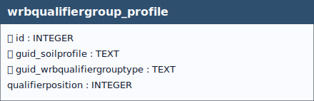

 # WRB Qualifier Group Profile

## Definition

> *The **`wrbqualifiergroup_profile`** table defines a **many-to-many relationship**
between soil profiles and **WRB qualifier groups**, linking the
**`soilprofile`** and **`wrbqualifiergrouptype`** tables.This relationship allows a single soil profile to be associated with one or
more WRB qualifier groups and, conversely, enables the same WRB qualifier group
to be assigned to multiple soil profiles.*

A **WRB qualifier group** is defined as a data type representing:

- the **qualifier group** according to the World Reference Base (WRB);
- the **possible specifier(s)** associated with the qualifier;
- its **placement and position** within the formal WRB sequence.

Through this structure, the application of WRB qualifiers to soil profiles can
be explicitly and flexibly modelled, preserving both their **taxonomic meaning**
and their **order and role** within the WRB classification system.

> [!NOTE]
> In order to assign a WRB classification to a soil profile, the corresponding wrbqualifiergrouptype records must first be created.

&nbsp;

  
 <!--
  <strong>TABELLA SOILSITE EXP</strong> 
   Lorem Ipsum.
 -->

 

&nbsp;

## Table: `wrbqualifiergroup_profile`

### Columns

| Name | Type | Constraints | Description |
|------|------|-------------|-------------|
| `id` | `INTEGER` | PRIMARY KEY | Primary Key of the Table. |
| `guid_soilprofile` | `TEXT` | NOT NULL | Foreign key to the SaoilProfile table, guid field. |
| `guid_wrbqualifiergrouptype` | `TEXT` | NOT NULL | Foreign key to the WrbqualifierGroupType table, guid field. |
| `qualifierposition` | `INTEGER` | NOT NULL | Number to indicate the position of a qualifier with regard to the WRB reference soil group (RSG) it belongs to and with regard to its placement to that (RSG) i.e. as a prefix or a suffix. |

### Relationships (as child)
- `wrbqualifiergroup_profile.guid_wrbqualifiergrouptype` → `wrbqualifiergrouptype.guid` (**ON UPDATE** CASCADE, **ON DELETE** CASCADE)
  - *Note:* delete on `wrbqualifiergrouptype` cascades to `wrbqualifiergroup_profile`.
- `wrbqualifiergroup_profile.guid_soilprofile` → `soilprofile.guid` (**ON UPDATE** CASCADE, **ON DELETE** CASCADE)
  - *Note:* delete on `soilprofile` cascades to `wrbqualifiergroup_profile`.

### Referenced by (as parent)
- None

### Indexes

| Name | Unique | Columns | Origin | Partial |
|------|--------|---------|--------|---------|
| `sqlite_autoindex_wrbqualifiergroup_profile_1` | Yes | `guid_soilprofile`, `guid_wrbqualifiergrouptype` | `u` | No |

### Triggers
For every trigger you will find:

- **When it runs** (BEFORE/AFTER, INSERT/UPDATE/DELETE)
- **What it reads and compares** (columns, lookups in other tables)
- **What happens on success** (the statement proceeds, optional updates)
- **What happens on failure** (the exact error text raised)

 

#### `i_check_wrbversion_match` / `u_check_wrbversion_match`
**When they run:** BEFORE INSERT / BEFORE UPDATE

**What they do:** Read `wrbversion` from the linked `soilprofile` and `wrbqualifiergrouptype` and ensure they **match**.

**If the check passes:** Statement proceeds.

**If the check fails:** Aborts with: `Mismatch in wrbversion values`.

#### `i_check_qualifier_position_unique` / `u_check_qualifier_position_unique`
**When they run:** BEFORE INSERT / BEFORE UPDATE

**What they do:** Within the **same soilprofile** and **same qualifier place**, ensure `qualifierposition` is **unique**.

**If the check passes:** Statement proceeds.

**If the check fails:** Aborts with: `qualifierposition must be unique for each qualifierplace within the same soilprofile`.

