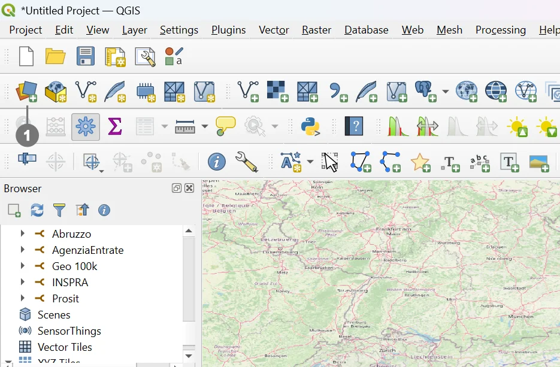
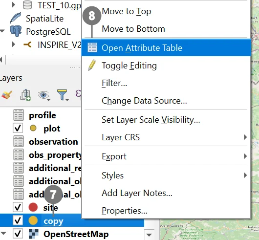
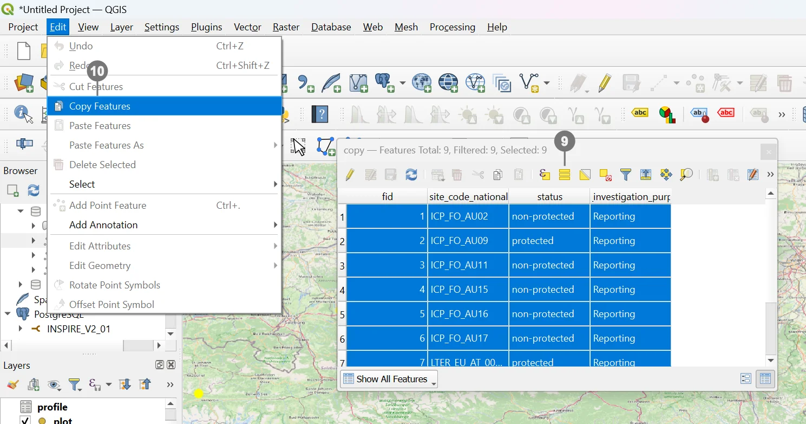
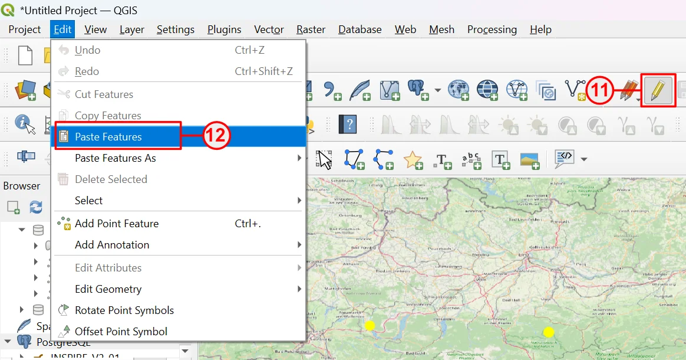
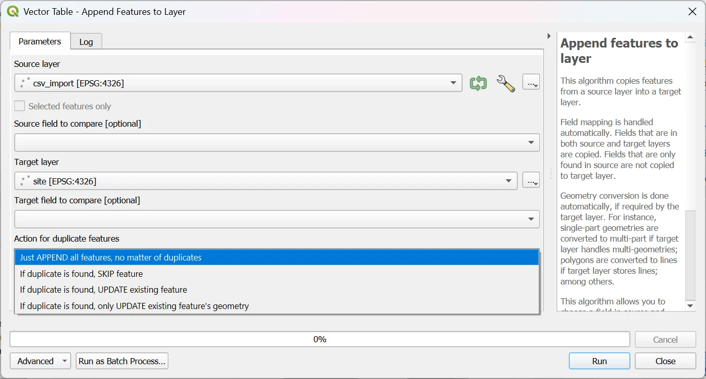

# Importing Geometric Features into the _soilwise_ GeoPackage

This guide explains how to import geometric layers into the **_soilwise_** GeoPackage in a correct, auditable, and repeatable way. It caters to both **SQL/DB‑centric** workflows and **QGIS‑based** operations, with an additional **plugin‑driven** option for a guided process. For complex mappings, alternative **ETL** tools are also listed.

> [!IMPORTANT]
> A GeoPackage is an **SQLite** database that stores geospatial data (features, rasters, attributes) based on the **OGC GeoPackage Encoding Standard**. This means you are writing to a single, portable database file (`.gpkg`). 

---

## Geometry-bearing features in _soilwise_

- **Soil Site** — *polygon*
- **Soil Plot** — *point*
- **Soil Body** — *geometry as defined by the official schema* (e.g., polygon/multipolygon; confirm against the model)
- **Soil Derived Object** — *polygon*
- **Datastream** — *polygon (optional)*

> [!NOTE]
> Before importing, confirm that each source layer’s **geometry type** (including multipart vs singlepart) matches the _soilwise_ model expectation.

---

## Prerequisites & Best Practices (apply to all methods)

- **CRS**: use the project-wide, agreed coordinate reference system and reproject sources **before** import when needed.
- **Valid geometries**: ensure geometry validity/topology (closed polygons, no self‑intersections, points within expected extent). QGIS provides native tools for validation and repair.
- **Attribute schema**: align field names, data types, and constraints (PK/UK, domains/codelists) prior to import.
- **IDs/keys**: guarantee primary key uniqueness; avoid duplicates.
- **Multipart vs singlepart**: respect the target model.
- **Logging & traceability**: record source, date, version, and procedure used (SQL, QGIS, plugin) for reproducibility and audits.

---

## Overview of import methods (choose what fits your workflow)

1) **Method 1 — SQL import (direct insert into the GeoPackage)**  
   Perform the import using an **SQL query** that inserts features directly into tables in the GeoPackage (remember: GeoPackage is SQLite-based). This is ideal when your data already resides in a structured source and you want a **repeatable, scriptable** pipeline. 
   - **Use when**: bulk migrations; fine-grained control over mapping, IDs, and domains.
   - **Prerequisites**: write access to the `.gpkg`; functions/approach to construct the geometry (e.g., WKT/WKB → geometry); correct **SRID** and **geometry type** as per _soilwise_.
   - **Caveats**: respect PK/UK and domain constraints; validate geometries after `INSERT`.

2) **Method 2 — QGIS “workaround” (copy/paste from a source layer to the GeoPackage)**  
   A quick import by **copy & paste** from a source layer into the destination layer inside the GeoPackage, directly within QGIS. citeturn5search2
   - **Use when**: you have little or no SQL experience and prefer a **visual, GIS‑style** workflow where you can see and edit geometries as you import.
   - **Prerequisites**: compatible **fields** (name/type) or manual mapping in QGIS; matching **CRS** and **geometry type**; destination layer set **in editing mode**.
   - **Caveats**: field mismatches can truncate or misalign attributes; prefer harmonizing with tools like **Refactor fields** and run geometry validation post-import. 

3) **Method 3 — QGIS via Plugin (guided, simplified workflow)**  
   Use a dedicated **QGIS plugin** to assist the import: field mapping, CRS checks, geometry validation, normalization, and safe append.
   - **Use when**: you want a **guided**, repeatable process less prone to manual mistakes; suitable for non‑SQL users.
   - **Prerequisites**: install/enable the plugin (QGIS → *Plugins* → *Manage and Install Plugins…*), configure mapping to the _soilwise_ schema.
   - **Caveats**: document plugin version/settings; check how it handles missing fields, domains, SRID, multipart, and editing conflicts. 

---

## Method 1 — SQL import (direct insert into the GeoPackage)

#### TO DO
---

## Method 2 — QGIS: copy/paste features into the GeoPackage

The import of geometries into an existing table of a GeoPackage with QGIS is structured in three main steps:

1. **Importing** geometries as a layer in QGIS  
2. **Copying** the imported geometries  
3. **Pasting** the geometries into the GeoPackage layer  

Let’s look at each step in detail.

### 1) Importing geometries

QGIS allows the import of geometries from various formats, such as CSV, Shapefile, or other GeoPackages. In this example, we will import data from a CSV file.

- Click the **Open Data Source Manager** button <mark>(1)</mark> in the QGIS toolbar.

  
  In the window that opens, you can choose from various data sources to import. 
  In our example, select <strong>CSV</strong> ② as the source format and proceed with importing the desired file ③. 
  Check the <strong>geometry type</strong> (e.g., WKT or coordinates separated into latitude/longitude) ④. 
  Set the correct <strong>Coordinate Reference System (CRS)</strong> ⑤. 
  Click <strong>Add</strong> ⑥ to create the layer (in this case, a point layer) in the project.

``

  

  

  

> [!WARNING]
> For the copy–paste operation to work correctly, the **source layer** (from which geometries are copied) must have the **same fields** (name and data type) as the **destination layer**, or at least match the required fields.  
> This check can be done during the import phase, later using QGIS tools, or by using an RDBMS to modify or remove unnecessary fields.  
> In this example, since the check was not performed during import, a temporary support layer named **“copy”** was created and used for preprocessing.

### 2) Copying geometries

  
- Import the newly created layer (if it is not already present in the project).   
- Right‑click the layer name <mark>(7)</mark> and, from the context menu, select **Open Attribute Table** <mark>(8)</mark> to view its data. 

  

  
- **Select all** geometries <mark>(9)</mark>.  
- **Copy** the geometries <mark>(10)</mark>.

  

### 3) Pasting geometries

  
- Enable **editing mode** on the destination GeoPackage layer using the **Toggle Editing** button <mark>(11)</mark>.  
- **Paste** the geometries <mark>(12)</mark>.  
- **Save** the changes.

  

## Method 3 — QGIS: import via Plugin (simplified workflow)

### QGIS plugin support

To support this procedure, there is also a QGIS plugin that simplifies and extends the described steps.  
It is called **AppendFeaturesToLayer** and is available at:  
[github.com/gacarrillor/AppendFeaturesToLayer](https://github.com/gacarrillor/AppendFeaturesToLayer)

The plugin includes two geoprocessing tools:

- **ETL_LOAD** — allows easy matching of the source table with the destination geometry table.

  

  

  

- **Append Feature To Layer** — handles the copy–paste operation with additional advanced options.

  

  

  

---

## Alternative ETL tools (optional)

For complex mappings, schema reconciliation, and automation, consider:

- **HALE Studio** — Open‑source ETL focused on harmonization toward standards (OGC/INSPIRE), with integrated validation and broad format support; helpful to define and document repeatable transformations. 
  <https://wetransform.to/halestudio/>

- **KNIME** — Visual data/ETL platform with hundreds of connectors/nodes; suitable for reusable and scheduled pipelines, DB integrations, and more. 
  <https://www.knime.com/>

## Final quality checklist

- [ ] Correct, consistent **CRS** across imported layers
- [ ] **Valid geometries** (no topological errors)
- [ ] Required fields present and with **correct types**
- [ ] **PK/UK** respected; no duplicates
- [ ] Domains/codelists enforced (allowed values only)
- [ ] **Source**, **date**, and **procedure** documented
- [ ] Visual check in QGIS (symbology, expected extent)

## References 

- **OGC GeoPackage** — Official standard/specification and overview pages.  
  <http://www.geopackage.org/> • <https://www.ogc.org/standards/geopackage/> • <https://www.geopackage.org/spec140/index.html> 
- **QGIS** — Official download and project pages (desktop editing, validation, GeoPackage support).  
  <https://qgis.org/download/> • <https://qgis.org/> 
- **HALE Studio** — Product/feature overview.  
  <https://wetransform.to/halestudio/> 
- **KNIME** — Platform overview.  
  <https://www.knime.com/>

