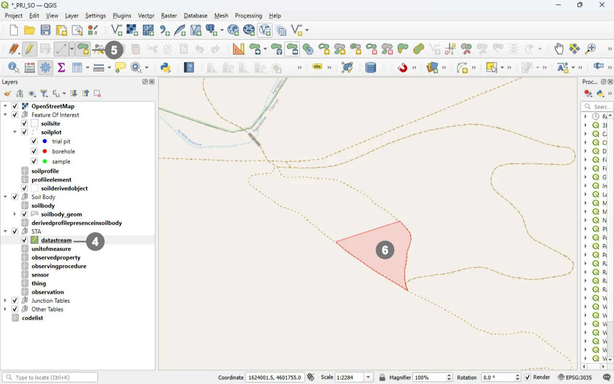
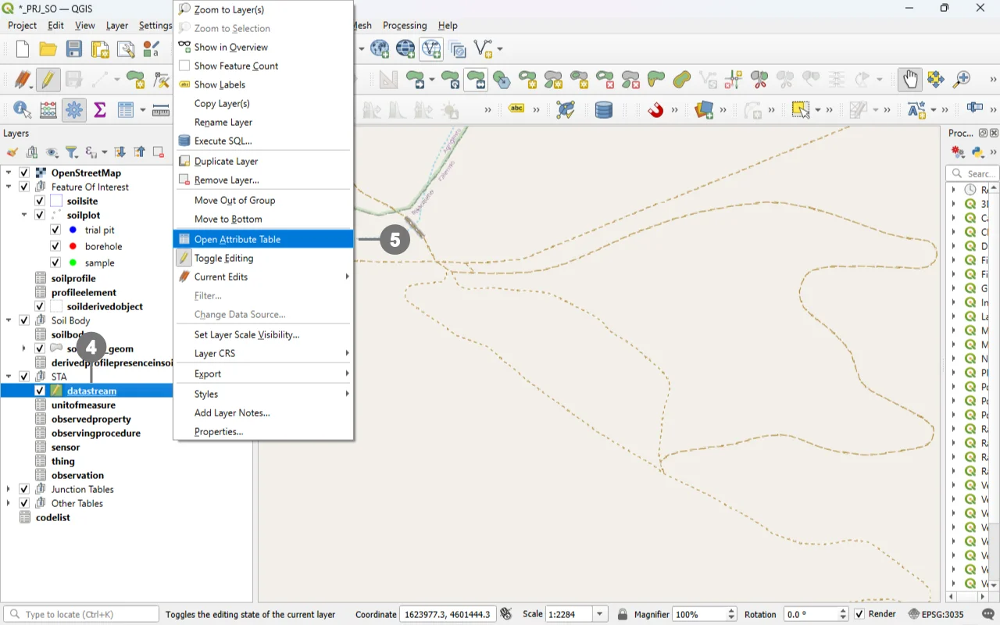
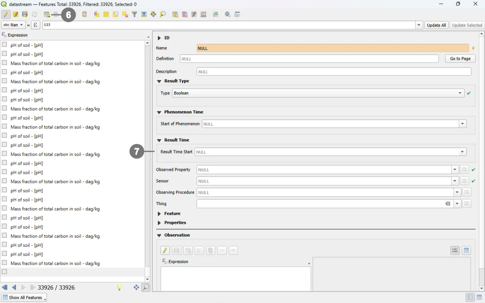
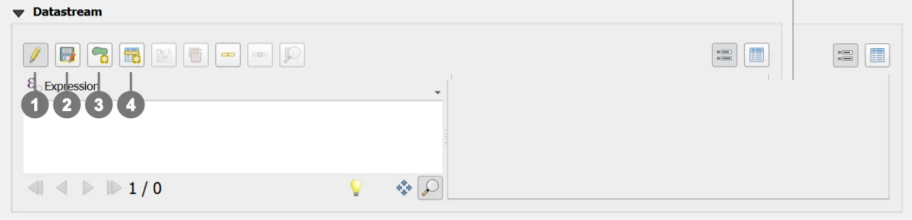
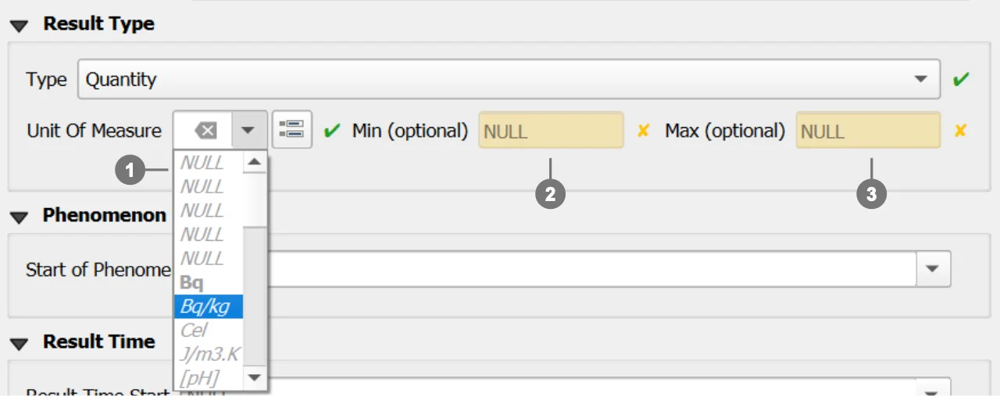
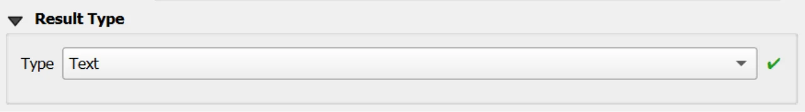
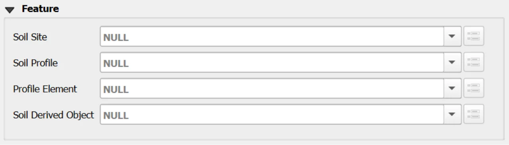

# Datastream Form

## Open
To open the Datastream custom forms, go to the Layers panel, right‑click the `datastream` layer, and choose **Open Attribute Table** from the context menu.

> [!TIP]
> For further information on the custom forms, consult the documents [Customized Attribute Forms in QGIS](./custom_form.md) and [Navigating GeoPackage Tables via Forms](./navigating_via_form.md)  

## Edit

Unlike most attribute‑only tables, **Datastream** includes an **optional geometry** (observedarea as POLYGON, EPSG:3035). This makes editing slightly more complex because a Datastream can behave either as a feature layer (when a geometry is present) or simply as an attribute table (when geometry is NULL). Both cases are valid.

  
Right-click in the "Layers" panel on the "datastream", ① and from the menu, select "Toggle Editing" ②.
  
Alternatively, select only the “datastream” layer ① and click the “Toggle Editing” button ③ in the toolbar.

  

### With geometry

  
A small pencil icon ④ will appear, indicating that the feature is in edit mode.
  
In the toolbar, select the "Add Polygon Feature" icon ⑤ and draw the geometry of the new "Datastream". ⑥

  

  
Right-click to close the geometry, and the data entry form will appear. ⑦

Use the widgets provided by the form to modify data.

  

### Without geometry

  
A small pencil icon ④ will appear, indicating that the feature is in edit mode.
  
Right-click in the "Layers" panel on the "datastream", and from the menu, select "Open Attribute Table" ⑤

  

  
Click the "Add Feature" buttn; ⑥ a new data‑entry form will appear on the right. ⑦

Use the widgets provided by the form to modify data.

  

For detailed information on how to initiate edit mode for a custom form, refer to the [Editing Records Through a QGIS Form](./edit_form.md) documentation.

### Editing Datastream via Child Elements (QGIS Sub‑Forms)
Editing Datastream records through child elements (sub‑forms embedded in the parent form) is the most reliable and efficient workflow for your INSPIRE Soil GeoPackage. It keeps users in context, auto‑populates foreign keys, and mirrors database integrity rules at the point of entry. 

Why “child‑form editing” is the best option for Datastream

Context‑aware data entry: Working inside the parent form (e.g. Soil Site, Soil Profile, Profile Element or Soil Derived Object) ensures the Datastream receives the correct parent keys without manual copying. QGIS relations and their forms are explicitly designed to connect and edit related tables in place.

Integrity by design: The QGIS relation editor widget exposes dedicated child‑layer controls and honors relationship cardinalities, minimizing orphan data and key mismatches. It includes built‑in actions for Add child feature and Save child edits. 

  

  

Use the following buttons to manage child layers during data editing.
  
**Toggle editing mode for child layer** ① enables editing on the related (child) layer embedded in the form; once active, you can add/modify/delete child records directly from the parent record’s view.

**Save child layer edit** ② commits the pending edits for the child layer to the GeoPackage. Use this to persist changes without leaving the parent form.

**Add Polygon Feature** ③ tool in QGIS allows users to create new polygon geometries within an editable vector layer.

**Add child feature** ④ creates a new child record pre‑linked to the current parent (relation fields are auto‑populated by the form’s relation widget), ensuring correct foreign keys and preventing orphan rows.

### REQUIRED fields
- `id`: primary key (auto-incrementing)
- `name`: TEXT
- `type`: TEXT (constrained values)
- `guid_sensor`: TEXT (FK)
- `guid_observedproperty`: TEXT (FK)

### ID Group

  

  

#### Fields

- **`id`** - Primary **AUTO_INCREMENT INTEGER PRIMARY KEY**; it’s the required identifier for GeoPackage tables and is assigned automatically on insert.

- **`guid`** - **Global identifier** in UUID format, stored as text. The field is **optional**. It's **automatically managed via triggers**.

> [!IMPORTANT]
> On opening, the **ID** group is collapsed: there is no need for manual editing, as **both fields are system‑managed** (the `id` by the SQLite engine and the `guid` by triggers), reducing errors and ensuring identifier consistency over time.

### Result Type

The custom form dynamically adapts its layout and available fields based on the selected **Result Type**. ①

When a Result Type is chosen, the form automatically displays only the fields that are required or optional for that specific type, while hiding or disabling fields that are not allowed.  
This behavior ensures a correct and consistent definition of the Result Type and prevents invalid configurations.

Each Result Type enforces a specific set of **required**, **optional**, and **forbidden** fields, as described below.

  

  

> [!IMPORTANT]
>  For further details about the **Result Type** definition, validation rules, and related constraints, please refer to the  [documentation](../tables/datastream.md) of the **Datastream** table.

#### Result Type: Boolean

**Description**  
Used to represent binary values (true/false).

  

  

**Forbidden fields**
- `iduom`
- `codespace`
- `value_min`
- `value_max`

#### Result Type: Category

**Description**  
Used to represent categorical or classified values defined within a controlled code list.

  

  

**Required fields**
- `codespace` ① The user can select a codespace from the list of codespaces already available in the system.

**Forbidden fields**
- `iduom`
- `value_min`
- `value_max`

> [!IMPORTANT]
>  For further information about codespaces and instructions on how to add them to the geopackage, please refer to the [documentation](../tables/codelist.md) of the **Codelist** table.

#### Result Type: Count

**Description**  
Used to represent integer counts or occurrences.

  

  

**Optional fields**
- `value_min`①
- `value_max`②

**Forbidden fields**
- `iduom`
- `codespace`

**Additional constraints**
- If both `value_min` and `value_max` are provided, then:
  - `value_max` **must be greater than** `value_min`

#### Result Type: Quantity

**Description**  
Used to represent measurable quantities associated with a numeric value and a unit of measure.

  

  

**Required fields**
- `iduom` (unit of measure) ① The widget allows users to select the available **units of measure** stored in the Geopackage.

**Optional fields**
- `value_min`②
- `value_max` ③

**Forbidden fields**
- `codespace`

> [!IMPORTANT]
>  Additional units of measure can be added to the system by inserting new records into the [**`unitofmeasure`** ](../tables/unitofmeasure.md)  table.

#### Result Type: Text

**Description**  
Used to represent free-text or descriptive values.

  

  

**Forbidden fields**
- `iduom`
- `codespace`
- `value_min`
- `value_max`

### Observed Property - Sensor - Observing Procedure  - Thing

  

  

The **Relation Reference** widgets for **Observed Property**, **Sensor**, **Observing Procedure**, and **Thing** reference the records stored in their respective tables.

Each dropdown list displays **only the rows available in the corresponding Geopackage table**, ensuring data consistency and referential integrity.

#### Mandatory and Optional Fields

- **Observed Property**: **Required**
- **Sensor**: **Required**
- **Observing Procedure**: Optional
- **Thing**: Optional

#### Observing Procedure Filtering Logic

The list of available **Observing Procedures** is dynamically filtered based on the selected **Observed Property**.

> [!IMPORTANT]
> This filtering is performed according to the relationships defined between **Observed Property** and **Observing Procedure** in the  
**`obsprocedure_obsdproperty`** table. Only Observing Procedures that are explicitly linked to the selected Observed Property will be available for selection.

> [!WARNING]
> **Validation Constraint**  
> If the selected **Observed Property – Observing Procedure** key pair is **not present** in the  
> **`obsprocedure_obsdproperty`** table, the system will raise an error and **prevent the insertion of the Datastream record**.

> [!NOTE]
> The Geopackage is distributed with a predefined set of **GLOSIS Observed Property – Observing Procedure** records,  
> including their relationships already defined in the **`obsprocedure_obsdproperty`** table.

### Feature 

  

    

A Datastream must be associated with **one and only one** parent Feature.  
Among the four available Features, **exactly one must be selected and must not be `NULL`**:

- Soil Site  
- Soil Profile  
- Profile Element  
- Soil Derived Object  

Selecting more than one Feature or leaving all of them unset is not allowed and will result in an invalid Datastream definition.

#### Recommended Workflow

It is **strongly recommended** to create Datastreams **through the child forms of the Features** rather than directly from the Datastream table, as this ensures that the Datastream automatically receives the correct parent keys without manual selection.

### Constraints
- **Type set**: `type ∈ {Quantity, Category, Boolean, Count, Text}` (CHECK).
- **Type combinations**: exclusive requirements among `code_unitofmeasure`, `codespace`, `value_min`, `value_max` by `type` (CHECK).
- **Bounds order**: if both bounds set, `value_min <= value_max` (CHECK + BEFORE INSERT/UPDATE).
- **Count bounds as integers**: when `type='Count'`, provided bounds must be numerically integral (BEFORE INSERT/UPDATE).
- **Codespace membership**: if `codespace` is not NULL, it must exist in `codelist(id)` for `collection='Category'` (BEFORE INSERT/UPDATE).
- **Procedure–Property pairing**: `(guid_observingprocedure, guid_observedproperty)` must exist in `obsprocedure_obsdproperty` on INSERT/UPDATE (BEFORE triggers).
- **Definition/Codespace URI hygiene**: syntax checks on `definition` and `codespace` (CHECK).
- **Phenomenon time propagation**: AFTER triggers keep `phenomenontime_*` equal to MIN/MAX across linked observations.
- **Bounds tightening protection**: updating `value_min/max` is aborted if any existing observation would fall outside the new bounds (BEFORE UPDATE).

### Attribute Reference
For an  overview of the **attributes used in the custom form**, refer to the soilsite table  [documentation](../tables/datastream.md). It provides the key definitions and data types needed to correctly interpret the fields and configure the form within the data model.

## Save

For a more comprehensive overview of form‑saving workflows, refer to the detailed documentation in [Saving Edits in QGIS Forms](./save_form.md).
