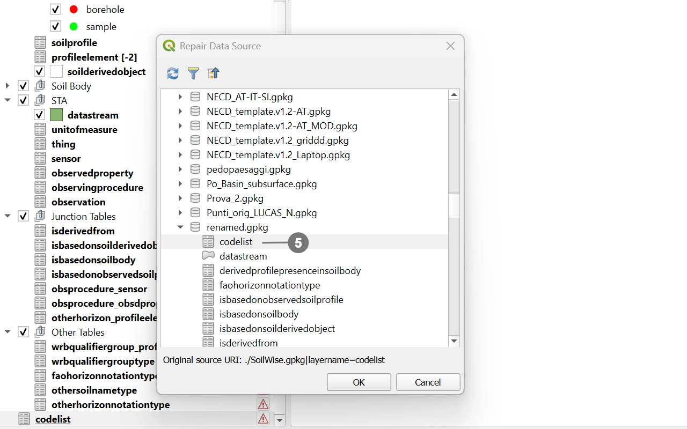

# How to Handle Issues Caused by Renaming the Soilwise GeoPackage

When a QGIS project is saved inside a GeoPackage, it stores **hard‑coded paths and references to the file using its exact filename**. These references are not dynamic—QGIS does not automatically update them if the file name changes.

As a result, **renaming the GeoPackage alters a critical part of the stored path (the filename)**, preventing QGIS from locating the layers contained within it. This causes **all internal links to break**, leading to data source errors and, in many cases, preventing the project from loading correctly.

>[!WARNING]
>Even a simple change to the `.gpkg` filename is enough to break the entire referencing system the project relies on, because all paths continue to point to the original name.

## Manual Path Repair for the PRJ_SO Project

When the GeoPackage is renamed, opening the **PRJ_SO** project will trigger a dialog informing you that the **relative paths are corrupted**.  
Follow the steps below to restore all layer connections:

  
Click <strong>“Keep Unavailable Layers”</strong> ① in the warning dialog.  

  

>[!NOTE]
>The **Auto‑Find** button usually fails to resolve the issue.  It is therefore recommended to follow the instructions below.

  
QGIS will load all layers, but they will show a <strong>warning triangle icon</strong> ② indicating that their data sources cannot be found.

Right‑click any broken layer ③ and choose <strong>“Repair Data Source”</strong> ④.

    

  
A new window will appear. Select the <strong>correct GeoPackage file</strong> with the new name ⑤.

   

After selecting the correct file, QGIS will automatically repair **the selected layer and all other layers** affected by the rename.

**Save the project** once the paths are restored.  

>[!IMPORTANT]
>This means you can safely distribute the project, and **users will be able to [open it](./open_geopackage.md) without repeating the procedure**, because the updated paths are already embedded in the project itself.

## Using the *Change Gpkg Path* Plugin to Handle Renamed GeoPackages

If the GeoPackage has been renamed and the project can no longer locate its internal data sources, you can use the **Change Gpkg Path** plugin to automatically fix all broken references:

🔗 **Plugin repository:** https://github.com/cxcandid/changeGpkgPath

Once installed, the plugin will:

- Detect that the GeoPackage filename has changed  
- Automatically **update all internal paths and layer references** in the project  
- Reload the project correctly using the new GeoPackage name  

After the project is opened with the updated paths, simply **save the project again**.  
At this point, all corrected references are stored directly inside the project file.

>[!IMPORTANT]
>This means you can safely distribute the project, and **users will be able to [open it](./open_geopackage.md) without installing the plugin**, because the updated paths are already embedded in the project itself.
