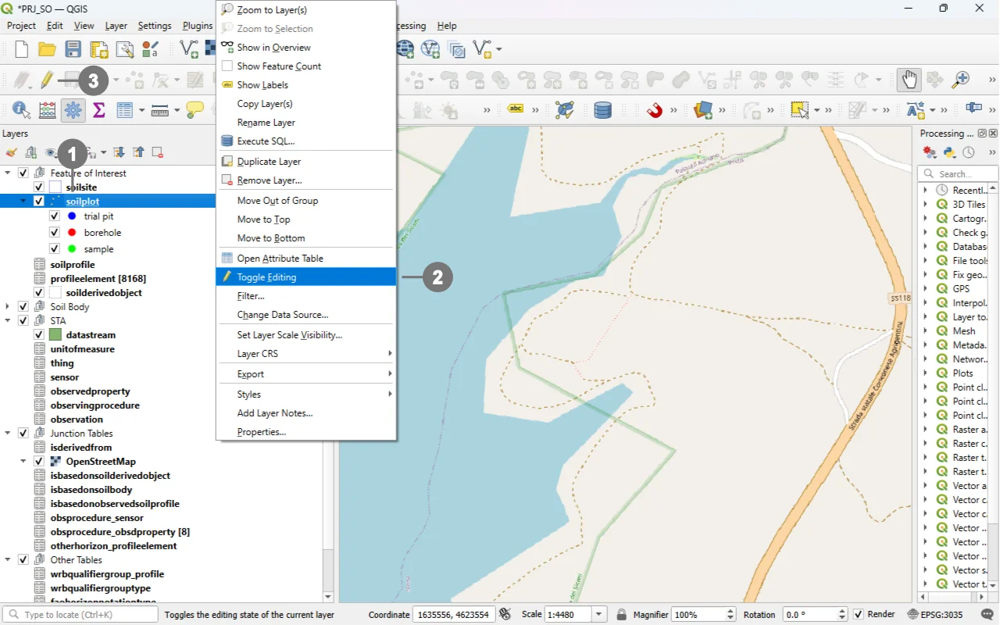
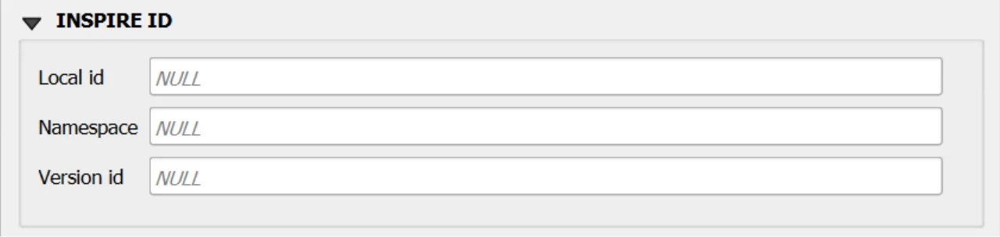

# Soil Plot Form

## Open
To open the Soil Plot custom forms, go to the Layers panel, right‑click the `soilplot` layer, and choose **Open Attribute Table** from the context menu.

> [!TIP]
> For further information on the custom forms, consult the documents [Customized Attribute Forms in QGIS](./custom_form.md) and [Navigating GeoPackage Tables via Forms](./navigating_via_form.md)  

## Edit

The "Soil Plot" it's a **point-based geographic entity**. The first step To create a new Soil Plot feature is to define its geometry.

  
Right-click in the "Layers" panel on the "soilsite", ① and from the menu, select "Toggle Editing" ②.
  
It is also possible to select only the "Soil Site" layer ① and click the "Toggle Editing", ③ button in the toolbar.

  

  
A small pencil icon ④ will appear, indicating that the feature is in edit mode.
  
In the toolbar, select the "Add Point Feature" icon ⑤.

To add a new point, **click directly on the map** ⑥.   A marker will be created at the exact location where you click

  

  
As soon as the point is created, the data entry form will open. ⑦

You can modify the data using the various widgets provided by the form.

  

For detailed information on initiating edit mode for a custom form, refer to the [Editing Records Through a QGIS Form](./edit_form.md).documentation.

### REQUIRED fields
- `id`: primary key (auto-incrementing)
- `Soil Plot Type`: TEXT (codelist)
- `Begin Lifespan version`: DATETIME (default: today)
  
### ID Group

  

  

#### Fields

- **`id`** - Primary **AUTO_INCREMENT INTEGER PRIMARY KEY**; it’s the required identifier for GeoPackage tables and is assigned automatically on insert.

- **`guid`** - **Global identifier** in UUID format, stored as text. The field is **optional**. It's **automatically managed via triggers**.

> [!IMPORTANT]
> On opening, the **ID** group is collapsed: there is no need for manual editing, as **both fields are system‑managed** (the `id` by the SQLite engine and the `guid` by triggers), reducing errors and ensuring identifier consistency over time.

### INSPIRE ID Group

  

  

>An **INSPIRE ID** is the **external unique identifier** assigned to each spatial object in INSPIRE datasets; it ensures **uniqueness** and **persistence** and allows external applications to reliably reference the same object over time.
The identifier **must not be changed** during the object’s life cycle; it can also be published as a **URI** to facilitate web-based referencing. [^1]

[^1]: Creating INSPIRE external unique object identifiers in the scope of the END reporting.
https://epanet.eea.europa.eu/Eionet/reportnet/docs/noise/guidelines/inspire_identifiers_doc.pdf 

#### Fields

- **`Local id`** — Local identifier assigned by the data provider; **unique** within its namespace.
- **`Namespace`** — Namespace that uniquely identifies the data source/domain of the spatial object. 
- **`Version id`** — Identifier of the specific **version** of the object; **optional (voidable)** and used to distinguish different versions of the same object. 

> [!IMPORTANT]
> These fields are not mandatory, but **filling them out is strongly recommended**: they help uniquely identify the record in forms and across data exchanges.  
> In particular, `localid` + `namespace` form a stable identifier; `versionid` helps track changes over time.

### Constraints
- **CHECK**: `beginlifespanversion <= endlifespanversion` (BEFORE INSERT).
- **Codelist**: `soilplottype ∈ codelist(id)` where `collection='SoilPlotTypeValue'` (BEFORE INSERT/UPDATE).
- **GUID immutability**: `guid` auto-generated on INSERT; updates to `guid` aborted.
- **Versioning**: on UPDATE, `beginlifespanversion` refreshed if `endlifespanversion` is NULL/future; update aborted if `endlifespanversion` is past.

### Attribute Reference
For an  overview of the **attributes used in the custom form**, refer to the soilsite table  [documentation](../tables/soilplot.md). It provides the key definitions and data types needed to correctly interpret the fields and configure the form within the data model.

## Save

For a more comprehensive overview of form‑saving workflows, refer to the detailed documentation in [Saving Edits in QGIS Forms](./save_form.md).
