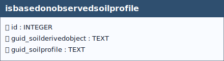

# Is Based On Observed Soil Profile

## Definition

> *The **`isbasedonobservedsoilprofile`** table defines a **many-to-many relationship** between soil-derived objects and observed soil profiles, linking the `soilderivedobject` and `soilprofile` tables.
This relationship allows soil-derived objects to be based on one or more soil profiles and, conversely, enables a single soil profile to contribute to multiple derived objects.*

&nbsp;

  
 <!--
  <strong>TABELLA SOILSITE EXP</strong> 
   Lorem Ipsum.
 -->

 

&nbsp;

## Table: `isbasedonobservedsoilprofile`

### Columns

| Name | Type | Constraints | Description |
|------|------|-------------|-------------|
| `id` | `INTEGER` | PRIMARY KEY | Primary Key of the Table. |
| `guid_soilderivedobject` | `TEXT` | NOT NULL | Foreign key to the SoilDerivedObject table, guid field. |
| `guid_soilprofile` | `TEXT` | NOT NULL | Foreign key to the SoilProfile table, guid field. |

### Relationships (as child)
- `isbasedonobservedsoilprofile.guid_soilprofile` → `soilprofile.guid` (**ON UPDATE** CASCADE, **ON DELETE** CASCADE)
  - *Note:* delete on `soilprofile` cascades to `isbasedonobservedsoilprofile`.
- `isbasedonobservedsoilprofile.guid_soilderivedobject` → `soilderivedobject.guid` (**ON UPDATE** CASCADE, **ON DELETE** CASCADE)
  - *Note:* delete on `soilderivedobject` cascades to `isbasedonobservedsoilprofile`.

### Referenced by (as parent)
- None

### Indexes

| Name | Unique | Columns | Origin | Partial |
|------|--------|---------|--------|---------|
| `sqlite_autoindex_isbasedonobservedsoilprofile_1` | Yes | `guid_soilderivedobject`, `guid_soilprofile` | `u` | No |

### Triggers

For every trigger you will find:

- **When it runs** (BEFORE/AFTER, INSERT/UPDATE/DELETE)
- **What it reads and compares** (columns, lookups in other tables)
- **What happens on success** (the statement proceeds, optional updates)
- **What happens on failure** (the exact error text raised)

 

#### `i_checkisobserved_dobj` / `u_checkisobserved_dobj`
**When they run:** BEFORE INSERT / BEFORE UPDATE

**What they do:** Ensure `guid_soilprofile` references an **OBSERVED** profile (`isderived = 0`).

**If the check passes:** Statement proceeds.

**If the check fails:** Aborts with: `Table isbasedonobservedsoilprofile : Attention, the value of the "guid_soilprofile" field cannot be inserted because profile is not of type observed`.

