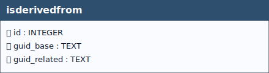

# Is Derived From

## Definition

> *The **`isderivedfrom`** table models a dependency relationship between **DERIVED** and **OBSERVED** soil profiles.  
It implements a **self-referential relationship** on the **`soilprofile`** table, allowing soil profiles to be linked to each other according to their role (derived or observed).
Specifically, the table associates each **derived soil profile** (`guid_base`) with one or more **observed soil profiles** (`guid_related`) from which the derived profile has been constructed or inferred, making the data provenance and the conceptual link between point observations and reference profiles explicit.*

From a conceptual perspective:

- a **derived soil profile** may be based on **0..N observed soil profiles**;
- an **observed soil profile** may contribute to **0..N derived soil profiles**.

The relationship is therefore **many-to-many (N:M)** between derived and observed soil profiles and is specialised by rules that enforce semantic consistency between the roles of the linked profiles.

&nbsp;

  
 <!--
  <strong>TABELLA SOILSITE EXP</strong> 
   Lorem Ipsum.
 -->

 

&nbsp;

## Table: `isderivedfrom`

### Columns

| Name | Type | Constraints | Description |
|------|------|-------------|-------------|
| `id` | `INTEGER` | PRIMARY KEY | Primary Key of the Table. |
| `guid_base` | `TEXT` | NOT NULL | Foreign key to the SoilProfile table, guid field. - Observed Soil Profile. |
| `guid_related` | `TEXT` | NOT NULL | Foreign key to the SoilProfile table, guid field. - Derived Soil Profile. |

### Relationships (as child)
- `isderivedfrom.guid_related` → `soilprofile.guid` (**ON UPDATE** CASCADE, **ON DELETE** CASCADE)
  - *Note:* delete on `soilprofile` cascades to `isderivedfrom`.
- `isderivedfrom.guid_base` → `soilprofile.guid` (**ON UPDATE** CASCADE, **ON DELETE** CASCADE)
  - *Note:* delete on `soilprofile` cascades to `isderivedfrom`.

### Referenced by (as parent)
- None

### Indexes

| Name | Unique | Columns | Origin | Partial |
|------|--------|---------|--------|---------|
| `sqlite_autoindex_isderivedfrom_1` | Yes | `guid_base`, `guid_related` | `u` | No |

### Triggers
For every trigger you will find:

- **When it runs** (BEFORE/AFTER, INSERT/UPDATE/DELETE)
- **What it reads and compares** (columns, lookups in other tables)
- **What happens on success** (the statement proceeds, optional updates)
- **What happens on failure** (the exact error text raised)

 

#### `i_checkisderived` / `u_checkisderived`
**When they run:** BEFORE INSERT / BEFORE UPDATE

**What they do:** For `guid_base`, ensure the referenced profile in `soilprofile` has `isderived = 1` (DERIVED).

**If the check passes:** Statement proceeds.

**If the check fails:** Aborts with: `Table isderivedfrom: Attention, the value of the "guid_base" field in the "isderivedfrom" table cannot be inserted because profile is not of type derived`.

#### `i_checkisobserved` / `u_checkisobserved`
**When they run:** BEFORE INSERT / BEFORE UPDATE

**What they do:** For `guid_related`, require the referenced profile in `soilprofile` to have `isderived = 0` (OBSERVED).

**If the check passes:** Statement proceeds.

**If the check fails:** Aborts with: `Table isderivedfrom: Attention, the value of the "guid_related" field in the "isderivedfrom" table cannot be inserted because profile is not of type observed`.

