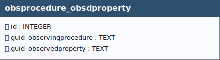

# Observed Procedure - Observed Property

## Definition

> *The **`obsprocedure_obsdproperty`** table defines a **many‑to‑many relationship** between observing procedures and observed properties, linking the **`observingprocedure`** and **`observedproperty`** tables. This relationship allows a single observing procedure to be associated with one or more observed properties and, conversely, enables the same observed property to be used by multiple observing procedures.*

## Integrity rule used by `datastream`

Only **procedure–property pairs** that are explicitly registered in **`obsprocedure_obsdproperty`** **shall** be persisted in the **`datastream`** table (`guid_observingprocedure`, `guid_observedproperty`).  
This constraint **shall be enforced** by triggers that verify pair membership **prior to** INSERT and UPDATE operations on `datastream`.  

>[!WARNING]
>If the specified pair **is not present** in `obsprocedure_obsdproperty`, the operation **shall be rejected** and the record **shall not be saved**.  
>Accordingly, each `datastream` **shall declare only** Observed Procedure - Observed Property combinations that are pre‑defined in the relational catalogue.

&nbsp;

  
 <!--
  <strong>TABELLA SOILSITE EXP</strong> 
   Lorem Ipsum.
 -->

 

&nbsp;

## Table: `obsprocedure_obsdproperty`

### Columns

| Name | Type | Constraints | Description |
|------|------|-------------|-------------|
| `id` | `INTEGER` | PRIMARY KEY | A unique, read-only attribute that serves as an identifier for the entity. |
| `guid_observingprocedure` | `TEXT` | NOT NULL | Foreign key to the  Procedure table, guid field. |
| `guid_observedproperty` | `TEXT` | NOT NULL | Foreign key to the Observed Property table, guid field. |

### Relationships (as child)
- `obsprocedure_obsdproperty.guid_observedproperty` → `observedproperty.guid` (**ON UPDATE** CASCADE, **ON DELETE** RESTRICT)
- `obsprocedure_obsdproperty.guid_observingprocedure` → `observingprocedure.guid` (**ON UPDATE** CASCADE, **ON DELETE** CASCADE)
  - *Note:* delete on `observingprocedure` cascades to `obsprocedure_obsdproperty`.

### Referenced by (as parent)
- None

### Indexes

| Name | Unique | Columns | Origin | Partial |
|------|--------|---------|--------|---------|
| `sqlite_autoindex_obsprocedure_obsdproperty_1` | Yes | `guid_observingprocedure`, `guid_observedproperty` | `u` | No |

### Triggers
- None

