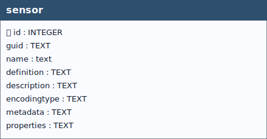

# Sensor
A Sensor is an entity that observes a property or phenomenon with the goal of producing an estimate of the value of the property. A Sensor may represent a piece of hardware, but a Sensor may also be a human or an algorithm implemented in software.

A Sensor entity in an OGC SensorThings API deployment can represent either a specific sensor instance, or a more generic sensor type. The distinction is generally quite clear from the Sensor metadata. Does the entity have detailed metadata that is specific to a sensor instance, like a serial number and calibration data, or is it used for many Datastreams attached to many different Things.

&nbsp;

  
 <!--
  <strong>TABELLA SOILSITE EXP</strong> 
   Lorem Ipsum.
 -->

 

&nbsp;

## Table: `sensor`

### Columns

| Name | Type | Constraints | Description |
|------|------|-------------|-------------|
| `id` | `INTEGER` | PRIMARY KEY | A unique, read-only attribute that serves as an identifier for the entity. |
| `guid` | `TEXT` |  | Universally unique identifier. |
| `name` | `TEXT` | NOT NULL | A property provides a label for Sensor entity, commonly a descriptive name. |
| `definition` | `TEXT` |  | The URI linking the Thing to an external definition. Dereferencing this URI SHOULD result in a representation of the definition of the Thing. |
| `description` | `TEXT` |  | The description of the Sensor entity. |
| `encodingtype` | `TEXT` |  | The encoding type of the metadata property. If the metadata field is present, an encodingType must be specified. |
| `metadata` | `TEXT` |  | The detailed description of the Sensor or system. The metadata type is defined by encodingType. |
| `properties` | `TEXT` |  | mime type: 'application/json'. A JSON Object containing user-annotated properties as key-value pairs. |

### Table Identifiers
In this table, the primary key is the *id* field (integer, auto-incrementing).  
There is also a text field named **GUID**, which stores a *UUID* (Universally Unique Identifier) compliant with RFC 4122.

Although GUID is not mandatory at the schema level (it is not declared NOT NULL), its functional requirement is enforced by two triggers:
- **sensorguid (INSERT)** trigger: if GUID is missing or empty, a correctly formatted UUID is generated and inserted automatically.
- **sensorguidupdate (UPDATE)** trigger: prevents any modification of GUID after insertion, making it immutable (effectively behaving as a stable key).  

Any foreign keys (FK) from other tables reference this table’s GUID field rather than the id field, ensuring stable and interoperable references across datasets and database instances.

### Relationships (as child)
- None

### Referenced by (as parent)
- `datastream.guid_sensor` → `sensor.guid` (**ON UPDATE** CASCADE, **ON DELETE** CASCADE)
- `obsprocedure_sensor.guid_sensor` → `sensor.guid` (**ON UPDATE** CASCADE, **ON DELETE** RESTRICT)

### Indexes

| Name | Unique | Columns | Origin | Partial |
|------|--------|---------|--------|---------|
| `sqlite_autoindex_sensor_1` | Yes | `guid` | `u` | No |

### Triggers
For every trigger you will find:

- **When it runs** (BEFORE/AFTER, INSERT/UPDATE/DELETE)
- **What it reads and compares** (columns, lookups in other tables)
- **What happens on success** (the statement proceeds, optional updates)
- **What happens on failure** (the exact error text raised)

 

#### `sensorguid` / `sensorguidupdate`
**When they run:** AFTER INSERT / AFTER UPDATE OF `guid`

**What they do:** Assign GUID at insert when missing; prevent changes later.

**If the check passes:** Insert writes GUID; unchanged updates proceed.

**If the check fails:** On change, abort with: `Cannot update guid column.`

---

