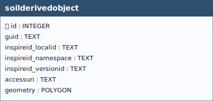

# Soil Derived Object

## Definition

> “*Spatial object with soil-related property derived from one or more soil and possibly other
non soil properties. Soil thematic maps can be derived directly from the involved soil
database (organic matter content, pH, texture, etc.) or they can be derived by using
pedotransfer functions or pedotransfer rules (e.g. plant available water in the rooting
depth). Derivation can be simple extraction from a single data field, or a complex
combination of different kind of data and application of e.g. mathematical or expert
knowledge-based procedures.*”[^1]

[^1]: European Commission – Joint Research Centre (JRC),  
**INSPIRE Data Specification on Soil – Technical Guidelines**,  
D2.8.III.3.  
https://inspire-mif.github.io/technical-guidelines/data/so/dataspecification_so.pdf

&nbsp;

  
 <!--
  <strong>TABELLA SOILSITE EXP</strong> 
   Lorem Ipsum.
 -->

 

&nbsp;

## Table: `soilderivedobject`

### Columns

| Name | Type | Constraints | Description |
|------|------|-------------|-------------|
| `id` | `INTEGER` | PRIMARY KEY | Primary Key of the Table. |
| `guid` | `TEXT` |  | Universally unique identifier. |
| `inspireid_localid` | `TEXT` |  | A local identifier, assigned by the data provider. The local identifier is unique within the namespace, that is no other spatial object carries the same unique identifier. |
| `inspireid_namespace` | `TEXT` |  | Namespace uniquely identifying the data source of the spatial object. |
| `inspireid_versionid` | `TEXT` |  | The identifier of the particular version of the spatial object, with a maximum length of 25 characters. If the specification of a spatial object type with an external object identifier includes life-cycle information, the version identifier is used to distinguish between the different versions of a spatial object. Within the set of all versions of a spatial object, the version identifier is unique. |
| `accessuri` | `TEXT` |  | SoilDerivedObject URI. |
| `geometry` | `POLYGON` |  | Geometry. |

### Table Identifiers
In this table, the primary key is the *id* field (integer, auto-incrementing).  
There is also a text field named **GUID**, which stores a *UUID* (Universally Unique Identifier) compliant with RFC 4122.

Although GUID is not mandatory at the schema level (it is not declared NOT NULL), its functional requirement is enforced by two triggers:
- **soilderivedobjectguid (INSERT)** trigger: if GUID is missing or empty, a correctly formatted UUID is generated and inserted automatically.
- **soilderivedobjectguidupdate (UPDATE)** trigger: prevents any modification of GUID after insertion, making it immutable (effectively behaving as a stable key).  

Any foreign keys (FK) from other tables reference this table’s GUID field rather than the id field, ensuring stable and interoperable references across datasets and database instances.

> [!NOTE]
> **GUID management** is handled by database triggers, which ensure their automatic generation at the time of record insertion, **without any user involvement**.

### Relationships (as child)
- None

### Referenced by (as parent)
- `datastream.guid_soilderivedobject` → `soilderivedobject.guid` (**ON UPDATE** CASCADE, **ON DELETE** CASCADE)
- `isbasedonobservedsoilprofile.guid_soilderivedobject` → `soilderivedobject.guid` (**ON UPDATE** CASCADE, **ON DELETE** CASCADE)
- `isbasedonsoilbody.guid_soilderivedobject` → `soilderivedobject.guid` (**ON UPDATE** CASCADE, **ON DELETE** CASCADE)
- `isbasedonsoilderivedobject.guid_related` → `soilderivedobject.guid` (**ON UPDATE** CASCADE, **ON DELETE** CASCADE)
- `isbasedonsoilderivedobject.guid_base` → `soilderivedobject.guid` (**ON UPDATE** CASCADE, **ON DELETE** CASCADE)

### Indexes

| Name | Unique | Columns | Origin | Partial |
|------|--------|---------|--------|---------|
| `idx_soilderivedobject_geom` | No | `geometry` | `c` | No |
| `sqlite_autoindex_soilderivedobject_1` | Yes | `guid` | `u` | No |

### Triggers
For every trigger you will find:

- **When it runs** (BEFORE/AFTER, INSERT/UPDATE/DELETE)
- **What it reads and compares** (columns, lookups in other tables)
- **What happens on success** (the statement proceeds, optional updates)
- **What happens on failure** (the exact error text raised)

 

#### `soilderivedobjectguid` / `soilderivedobjectguidupdate`
**When they run:** AFTER INSERT / AFTER UPDATE OF `guid`

**What they do:** Auto-assign a GUID on insert when missing; prevent changing it later.

**If the check passes:** Insert assigns GUID; unchanged updates proceed.

**If the check fails:** On change, abort with: `Cannot update guid column.`

---

