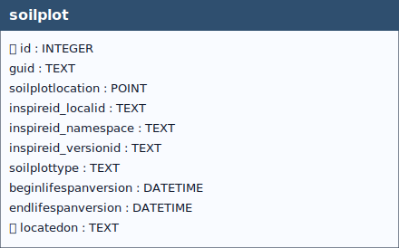

# Soil Plot

## Definition

> “*Is the location of a specific soil investigation.*”[^1]
[^1]: European Commission – Joint Research Centre (JRC),  
**INSPIRE Data Specification on Soil – Technical Guidelines**,  
D2.8.III.3.  
https://inspire-mif.github.io/technical-guidelines/data/so/dataspecification_so.pdf

&nbsp;

  
 <!--
  <strong>TABELLA SOILSITE EXP</strong> 
   Lorem Ipsum.
 -->

 

&nbsp;

## Table: `soilplot`

### Columns

| Name | Type | Constraints | Description |
|------|------|-------------|-------------|
| `id` | `INTEGER` | PRIMARY KEY | Primary Key of the Table. |
| `guid` | `TEXT` |  |  |
| `soilplotlocation` | `POINT` | NOT NULL | Geometry. |
| `inspireid_localid` | `TEXT` |  |  |
| `inspireid_namespace` | `TEXT` |  |  |
| `inspireid_versionid` | `TEXT` |  |  |
| `soilplottype` | `TEXT` | NOT NULL |  |
| `beginlifespanversion` | `DATETIME` | NOT NULL, DEFAULT strftime('%Y-%m-%dT%H:%M:%fZ', 'now') |  |
| `endlifespanversion` | `DATETIME` |  |  |
| `locatedon` | `TEXT` |  | Foreign key to the SoilSite table, guid field. |

### Table Identifiers
In this table, the primary key is the *id* field (integer, auto-incrementing).  
There is also a text field named **GUID**, which stores a *UUID* (Universally Unique Identifier) compliant with RFC 4122.

Although GUID is not mandatory at the schema level (it is not declared NOT NULL), its functional requirement is enforced by two triggers:
- **soilplotguid (INSERT)** trigger: if GUID is missing or empty, a correctly formatted UUID is generated and inserted automatically.
- **soilplotguidupdate (UPDATE)** trigger: prevents any modification of GUID after insertion, making it immutable (effectively behaving as a stable key).  

Any foreign keys (FK) from other tables reference this table’s GUID field rather than the id field, ensuring stable and interoperable references across datasets and database instances.

> [!NOTE]
> **GUID management** is handled by database triggers, which ensure their automatic generation at the time of record insertion, **without any user involvement**.

### Coded Fields

The **`soilplottype`** field is a **coded field** (*codelist-based attribute*), meaning that it can only contain values belonging to a predefined **codelist**, in accordance with the INSPIRE specifications.

> [!WARNING]
> Any attempt to insert a value that is not included in the corresponding codelist is considered **invalid** by the system and will result in the **failure of the data insertion operation**.

#### Codelist Definition

The complete list of allowed codes is stored in the **codelist table**.  
The associated [documentation](codelist.md), provides a detailed description of:

- which codes are available (codelist URL),
- the database tables to which each codelist applies,
- the fields for which each code is valid,

in accordance with the adopted conceptual model.

#### Validation and Data Entry

The semantic and syntactic validation of the inserted values is enforced at the database level through dedicated **control triggers** (i_soilplottype/u_soilplottype), ensuring compliance with the defined codelists.

> [!IMPORTANT]
>During data entry via the **QGIS interface**, users are supported by **dropdown menus** that display only the valid codes for the selected field.

> [!NOTE]
>This mechanism **reduces the risk of data entry errors** and guarantees alignment with the constraints imposed by the INSPIRE codelists.

### Relationships (as child)
- `soilplot.locatedon` → `soilsite.guid` (**ON UPDATE** CASCADE, **ON DELETE** NO ACTION)

### Referenced by (as parent)
- `soilprofile.location` → `soilplot.guid` (**ON UPDATE** CASCADE, **ON DELETE** CASCADE)

### Indexes

| Name | Unique | Columns | Origin | Partial |
|------|--------|---------|--------|---------|
| `idx_soilplot_geom` | No | `soilplotlocation` | `c` | No |
| `sqlite_autoindex_soilplot_1` | Yes | `guid` | `u` | No |

### Triggers
For every trigger you will find:

- **When it runs** (BEFORE/AFTER, INSERT/UPDATE/DELETE)
- **What it reads and compares** (columns, lookups in other tables)
- **What happens on success** (the statement proceeds, optional updates)
- **What happens on failure** (the exact error text raised)

 

#### `soilplotguid`
**When it runs:** AFTER INSERT

**What it does:** Generates a UUID v4 when `NEW.guid` is NULL.

**If the check passes:** Assigns the GUID.

**If the check fails:** No failure path.

#### `soilplotguidupdate`
**When it runs:** AFTER UPDATE OF `guid`

**What it does:** Prevents changing `guid` by comparing new vs old.

**If the check passes:** Update proceeds.

**If the check fails:** Aborts with: `Cannot update guid column.`

#### `i_ceckvalidversionsoilplot`
**When it runs:** BEFORE INSERT

**What it does:** Ensures `beginlifespanversion < endlifespanversion`.

**If the check passes:** Insert proceeds.

**If the check fails:** Aborts with: `Table soilplot: beginlifespanversion must be less than endlifespanversion`.

#### `i_soilplottype` / `u_soilplottype`
**When they run:** BEFORE INSERT / BEFORE UPDATE

**What they do:** Validate that `soilplottype` exists in `codelist.id` with `collection = 'SoilPlotTypeValue'`.

**If the check passes:** Statement proceeds.

**If the check fails:** Aborts with: `Table soilplot: Invalid value for soilplottype. Must be present in id of soilplottypevalue codelist.`

#### `u_begin_today_soilplot`
**When it runs:** AFTER UPDATE

**What it does:** If the plot is still active (future/NULL end), refreshes `beginlifespanversion` to **now**.

**If the check passes:** Timestamp is refreshed.

**If the check fails:** No failure path.

#### `u_begin_today_soilplot_error`
**When it runs:** AFTER UPDATE

**What it does:** Blocks edits when `endlifespanversion` lies in the **past**.

**If the check passes:** Update continues.

**If the check fails:** Aborts with: `If you change record endlifespanversion must be greater than today`.

---

