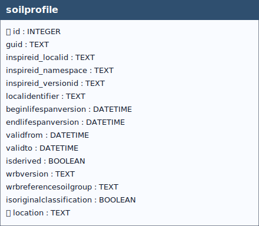

# Soil Profile

## Definition

> “***Soil Profile** can be defined as a cross-section of the soil from the surface down to and including the beginning of the fresh material unmodified by pedogenesis, consisting of various more or less horizontally oriented features formed by pedogenic processes called horizons.*”[^1]

[^1]: European Commission – Joint Research Centre (JRC),  
**INSPIRE Data Specification on Soil – Technical Guidelines**,  
D2.8.III.3.  
https://inspire-mif.github.io/technical-guidelines/data/so/dataspecification_so.pdf

## Observed vs Derived Soil Profile (INSPIRE)

In the INSPIRE *Soil* data model, an **Observed Soil Profile** represents a soil profile **found at a specific location**, typically documented from a trial pit or a borehole. A **Derived Soil Profile** is **non point‑located** and acts as a **reference profile** for a specific soil type over a broader geographic area. These concepts are defined in the INSPIRE Feature Concept Dictionary and described in the Technical Guidelines for the Soil theme.[^2][^3][^1]

## Field that determines the profile type

The boolean field **`soilprofile.isderived`** determines the profile type:

- `0` → **Observed Soil Profile**  
- `1` → **Derived Soil Profile**

This behavior is enforced at database level through triggers.

## Behavior of the `soilprofile` table per type

### Observed (`isderived = 0`)
- **Location required**: the **`location`** column **must be NOT NULL** and must reference an existing **`soilplot.guid`**. The column is **UNIQUE**, thus a single observed profile can be associated to a given `soilplot`. Triggers reject inserts/updates that violate these rules.  
- **Relations**: the observed profile can appear as **`guid_related`** in the `isderivedfrom` association (i.e., a derived profile is based on one or more observed profiles). Triggers ensure the referenced profile is indeed observed.  
- **O&M integration (`datastream`)**: when a `datastream` is linked to an **Observed Soil Profile**, logic resolves **Profile → Plot → Site** and sets **`datastream.guid_thing`** to the **SoilSite** GUID (creating the `thing` on demand if missing).

### Derived (`isderived = 1`)
- **No point location**: the **`location`** column **must remain `NULL`** (non point‑located profile). Triggers prevent non‑null values.  
- **Relations**:  
  - may appear as **`guid_base`** in `isderivedfrom`, linking the derived profile to its observed sources; triggers check type coherence.  
  - may be associated with `soilbody` through `derivedprofilepresenceinsoilbody`; triggers ensure the referenced profile is derived and enforce percentage sum constraints.  
- **O&M integration (`datastream`)**: when a `datastream` is linked to a **Derived Soil Profile**, **`datastream.guid_thing`** is set directly to the **derived profile** GUID (with on‑demand creation of the `thing`).

>[!WARNING]
> Records that do not comply with the defined constraints **shall be rejected by the system and shall not be persisted** in the GeoPackage.

[^2]: **Observed Soil Profile — INSPIRE Feature Concept Dictionary**.  
https://inspire.ec.europa.eu/featureconcept/ObservedSoilProfile

[^3]: **Derived Soil Profile — INSPIRE Feature Concept Dictionary**.  
https://inspire.ec.europa.eu/featureconcept/DerivedSoilProfile

[^4]: **INSPIRE Technical Guidelines — Soil (entry page, HTML/PDF)**.  
https://inspire-mif.github.io/technical-guidelines/data/so/

[^5]: **INSPIRE Soil — Overview slide deck (Site–Plot–Profile–Horizon/Layer pattern)**.  
https://zenodo.org/records/13970777/files/II3-INSPIRE-Soil.pdf

&nbsp;

  
 <!--
  <strong>TABELLA SOILSITE EXP</strong> 
   Lorem Ipsum.
 -->

 

&nbsp;

## Table: `soilprofile`

### Columns

| Name | Type | Constraints | Description |
|------|------|-------------|-------------|
| `id` | `INTEGER` | PRIMARY KEY | Primary Key of the Table. |
| `guid` | `TEXT` |  | Universally unique identifier. |
| `inspireid_localid` | `TEXT` |  | A local identifier, assigned by the data provider. The local identifier is unique within the namespace, that is no other spatial object carries the same unique identifier. |
| `inspireid_namespace` | `TEXT` |  | Namespace uniquely identifying the data source of the spatial object. |
| `inspireid_versionid` | `TEXT` |  | The identifier of the particular version of the spatial object, with a maximum length of 25 characters. If the specification of a spatial object type with an external object identifier includes life-cycle information, the version identifier is used to distinguish between the different versions of a spatial object. Within the set of all versions of a spatial object, the version identifier is unique. |
| `localidentifier` | `TEXT` |  | Unique identifier of the soil profile given by the data provider of the dataset. |
| `beginlifespanversion` | `DATETIME` | NOT NULL, DEFAULT strftime('%Y-%m-%dT%H:%M:%fZ', 'now') | Date and time at which this version of the spatial object was inserted or changed in the spatial data set. |
| `endlifespanversion` | `DATETIME` |  | Date and time at which this version of the spatial object was superseded or retired in the spatial data set. |
| `validfrom` | `DATETIME` | NOT NULL, DEFAULT strftime('%Y-%m-%dT%H:%M:%fZ', 'now') | The time when the phenomenon started to exist in the real world. |
| `validto` | `DATETIME` |  | The time from which the phenomenon no longer exists in the real world. |
| `isderived` | `BOOLEAN` | NOT NULL, DEFAULT 0 | Boolean value to indicate whether the record is of Derived or Observed type. |
| `wrbversion` | `TEXT` |  | Indicates the WRB classification version. |
| `wrbreferencesoilgroup` | `TEXT` |  | First level of classification of the World Reference Base for Soil Resources. |
| `isoriginalclassification` | `BOOLEAN` | NOT NULL, DEFAULT 1 | Boolean value to indicate whether the WRB classification system was the original classification system to describe the soil profile. |
| `location` | `TEXT` |  | Foreign key to the SoilPlot table, guid field. |

### Table Identifiers
In this table, the primary key is the *id* field (integer, auto-incrementing).  
There is also a text field named **GUID**, which stores a *UUID* (Universally Unique Identifier) compliant with RFC 4122.

Although GUID is not mandatory at the schema level (it is not declared NOT NULL), its functional requirement is enforced by two triggers:
- **soilprofileguid (INSERT)** trigger: if GUID is missing or empty, a correctly formatted UUID is generated and inserted automatically.
- **soilprofileguidupdate (UPDATE)** trigger: prevents any modification of GUID after insertion, making it immutable (effectively behaving as a stable key).  

Any foreign keys (FK) from other tables reference this table’s GUID field rather than the id field, ensuring stable and interoperable references across datasets and database instances.

> [!NOTE]
> **GUID management** is handled by database triggers, which ensure their automatic generation at the time of record insertion, **without any user involvement**.

### Coded Fields

The `wrbversion` and `wrbreferencesoilgroup`  fields are **coded fields** (*codelist-based attribute*), meaning that they can only contain values belonging to a predefined **codelists**, in accordance with the INSPIRE specifications.

> [!WARNING]
> Any attempt to insert a value that is not included in the corresponding codelist is considered **invalid** by the system and will result in the **failure of the data insertion operation**.

> [!NOTE]
> `wrbversion` is an internal codelist created to manage multiple versions of the WRB soil classification.
In accordance with the INSPIRE specifications, which require the WRBReferenceSoilGroupValue field to contain a valid WRB Reference Soil Group (RSG), this codelist has been introduced to indicate to the system the **RSG compliant with the selected year** of the WRB classification.

#### Codelist Definition

The complete list of allowed codes is stored in the **codelist table**.  
The associated [documentation](codelist.md), provides a detailed description of:

- which codes are available (codelist URL),
- the database tables to which each codelist applies,
- the fields for which each code is valid,

in accordance with the adopted conceptual model.

#### Validation and Data Entry

The semantic and syntactic validation of the inserted values is enforced at the database level through dedicated **control triggers** (i_wrbproversion/u_wrbproversion/i_wrbreferencesoilgroup/u_wrbreferencesoilgroup), ensuring compliance with the defined codelists.

> [!IMPORTANT]
>During data entry via the **QGIS interface**, users are supported by **dropdown menus** that display only the valid codes for the selected field.

> [!NOTE]
>This mechanism **reduces the risk of data entry errors** and guarantees alignment with the constraints imposed by the INSPIRE codelists.

### Relationships (as child)
- `soilprofile.location` → `soilplot.guid` (**ON UPDATE** CASCADE, **ON DELETE** CASCADE)
  - *Note:* delete on `soilplot` cascades to `soilprofile`.

### Referenced by (as parent)
- `datastream.guid_soilprofile` → `soilprofile.guid` (**ON UPDATE** CASCADE, **ON DELETE** CASCADE)
- `derivedprofilepresenceinsoilbody.guid_soilprofile` → `soilprofile.guid` (**ON UPDATE** CASCADE, **ON DELETE** CASCADE)
- `isbasedonobservedsoilprofile.guid_soilprofile` → `soilprofile.guid` (**ON UPDATE** CASCADE, **ON DELETE** CASCADE)
- `isderivedfrom.guid_related` → `soilprofile.guid` (**ON UPDATE** CASCADE, **ON DELETE** CASCADE)
- `isderivedfrom.guid_base` → `soilprofile.guid` (**ON UPDATE** CASCADE, **ON DELETE** CASCADE)
- `othersoilnametype.othersoilname` → `soilprofile.guid` (**ON UPDATE** CASCADE, **ON DELETE** CASCADE)
- `profileelement.ispartof` → `soilprofile.guid` (**ON UPDATE** CASCADE, **ON DELETE** CASCADE)
- `wrbqualifiergroup_profile.guid_soilprofile` → `soilprofile.guid` (**ON UPDATE** CASCADE, **ON DELETE** CASCADE)

### Indexes

| Name | Unique | Columns | Origin | Partial |
|------|--------|---------|--------|---------|
| `sqlite_autoindex_soilprofile_2` | Yes | `location` | `u` | No |
| `sqlite_autoindex_soilprofile_1` | Yes | `guid` | `u` | No |

### Triggers
For every trigger you will find:

- **When it runs** (BEFORE/AFTER, INSERT/UPDATE/DELETE)
- **What it reads and compares** (columns, lookups in other tables)
- **What happens on success** (the statement proceeds, optional updates)
- **What happens on failure** (the exact error text raised)

 

#### `soilprofileguid` / `soilprofileguidupdate`
**When they run:** AFTER INSERT / AFTER UPDATE OF `guid`

**What they do:** Auto-generate a GUID at insert if missing, and prevent changing it afterwards.

**If the check passes:** Insert writes GUID; updates with unchanged GUID proceed.

**If the check fails:** On change attempt, abort with: `Cannot update guid column.`

#### `i_ceckvalidperiodsoilprofile` / `u_ceckvalidperiodsoilprofile`
**When they run:** BEFORE INSERT / BEFORE UPDATE

**What they do:** Ensure `validfrom` is **not after** `validto`.

**If the check passes:** Statement proceeds.

**If the check fails:** Aborts with: `Table soilprofile: validto must be less than validfrom`.

#### `i_ceckvalidversionsoilprofile`
**When it runs:** BEFORE INSERT

**What it does:** Checks that `beginlifespanversion < endlifespanversion` (strict inequality).

**If the check passes:** Insert proceeds.

**If the check fails:** Aborts with: `Table soilprofile: beginlifespanversion must be less than endlifespanversion`.

#### `i_ceckprofileLocation` / `u_ceckprofileLocation`
**When they run:** BEFORE INSERT / BEFORE UPDATE

**What they do:** For **derived** profiles (`isderived = 1`), require `location` to be **NULL**.

**If the check passes:** Statement proceeds.

**If the check fails:** Aborts with: `Table soilprofile: For DERIVED profile (isderived = 1), location must be NULL`.

#### `i_ceckprofileLocationobserved` / `u_ceckprofileLocationobserved`
**When they run:** BEFORE INSERT (both, despite the `u_` prefix)

**What they do:** For **observed** profiles (`isderived = 0`), require `location` to be **NOT NULL**.

**If the check passes:** Insert proceeds.

**If the check fails:** Aborts with: `Table soilprofile: For OBSERVED profile (isderived = 0), location must be NOT NULL`.

#### `i_wrbreferencesoilgroup` / `u_wrbreferencesoilgroup`
**When they run:** BEFORE INSERT / BEFORE UPDATE

**What they do:** If `wrbversion` is set, check that `wrbreferencesoilgroup` exists in the **matching year’s** codelist collection (current/2014/2022).

**If the check passes:** Statement proceeds.

**If the check fails:** Aborts with (verbatim): `Table soilprofile: Invalid value for wrbversion. Must be present in id of the correct year codelist collection.`

#### `u_begin_today_soilprofile` / `u_begin_today_soilprofile_error`
**When they run:** AFTER UPDATE

**What they do:** Refresh `beginlifespanversion` to **now** when the record is still active; block edits when `endlifespanversion` is **past**.

**If the check passes:** Timestamp refreshed / update proceeds.

**If the check fails:** Aborts with: `If you change record endlifespanversion must be greater than today`.

#### `i_wrbproversion` / `u_wrbproversion`
**When they run:** BEFORE INSERT / BEFORE UPDATE

**What they do:** Require `wrbversion` to exist in `codelist.id` for `collection = 'wrbversion'`.

**If the check passes:** Statement proceeds.

**If the check fails:** Aborts with (verbatim): `Table soilprofile: Invalid value for wrbversion. Must be present in id of wrbreferencesoilgroupvalue codelist.`

