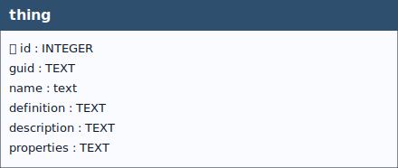

# Thing

## Definition

> *The OGC SensorThings API Standard follows the ITU-T definition with regard to the Internet of Things: A thing is an object of the physical world (physical things) or the information world (virtual things) that is capable of being identified and integrated into communication networks ITU-T-Y.2060. A Thing is related to the Platform entity as described in Section 4.9.2.1 of OGC 16-079 in a way that any entity that can be modelled as a Thing may be subsequently translated to a Platform and vice versa.* [^1]

> [^1]: Hylke van der Schaaf — **Open Geospatial Consortium (OGC)**,  
> **SensorThings API 2.0 (23-019)** *(DRAFT)*,  
> version 23-019.  
> https://hylkevds.github.io/23-019/23-019.html

# Management of the Thing Table in the GeoPackage

This document describes how the **Thing** table is automatically managed within the GeoPackage through a set of database triggers based on the **soft reference** principle.The automation ensures consistent creation, reuse, and maintenance of `Thing` records when **Datastreams** are created, while still allowing manual user intervention when needed.

When a **Datastream** is created **without explicitly specifying the `guid_thing` field**, the system automatically determines and associates an appropriate **Thing** based on the related **Feature of Interest (FoI)**.

The process follows a predefined set of rules to:
- create a new `Thing` if it does not exist;
- reuse an existing `Thing` if one is already available;
- maintain consistency across related entities.

### Soft Reference Principle

The system applies a *soft reference* strategy:
- The `Thing` table stores a GUID that mirrors the GUID of the related FoI.
- No hard foreign key constraint is enforced.
- Association is achieved by matching GUID values.

This approach allows flexibility while maintaining logical consistency.

### Rules for Thing Creation and Association

#### 1. Feature of Interest: Soil Site

When the FoI is a **Soil Site**:

- The system retrieves the GUID of the reference soil site.
- A row is created in the `Thing` table **only if it does not already exist**, using:
  - the same GUID (soft reference);
  - the same INSPIRE ID;
  - an INSPIRE-compliant description of the soil site.
- If another Datastream refers to the same soil site, the existing `Thing` is reused.

#### 2. Feature of Interest: Soil Derived Object

When the FoI is a **Soil Derived Object**:

- The system uses:
  - the GUID of the soil derived object;
  - the corresponding INSPIRE ID;
  - an appropriate INSPIRE-compliant description.
- The `Thing` row is created if it does not exist; otherwise, it is reused.

#### 3. Feature of Interest: Soil Profile

The system first determines the **type of soil profile**.

##### 3.1 Derived Soil Profile

- A `Thing` row is created (if not already present) using:
  - the GUID of the derived soil profile;
  - the INSPIRE ID;
  - an INSPIRE-compliant description of the derived profile.

##### 3.2 Observed Soil Profile

- The system navigates the hierarchy to identify the **parent soil site**.
- The corresponding `Thing` (identified by the soil site GUID) is:
  - created if missing;
  - reused if already present.

#### 4. Feature of Interest: Profile Element

When the FoI is a **Profile Element**:

- The system identifies the parent soil profile.
- It determines whether the profile is **derived** or **observed**.
- The same rules defined for **Soil Profiles** are applied to determine or create the associated `Thing`.

>[!IMPORTANT]
>**Fallback Case**
>If it is not possible to determine an appropriate `Thing`:
>
>- The system falls back to a predefined `Thing` named **“Soil”**.
>- This fallback `Thing`:
>  - has an INSPIRE-compliant description;
>  - is preloaded into the GeoPackage at publication time.

### Manual User Intervention

The automated management does **not** prevent user control.

Users can:
- manually select a different `Thing`;
- modify the `Thing` associated with a Datastream;
- create new `Thing` entries and associate them with Datastreams.

> [!NOTE]
>If no manual action is taken, the system fully manages `Thing` creation and association automatically.

> [!NOTE]
> **Propagation of Updates**
> Additional triggers ensure consistency when changes occur in the GeoPackage involving:
>- soil derived profiles;
>- soil sites;
>- soil derived objects.
>
>When these entities are updated:
>- the corresponding `Thing` entries are automatically updated;
>- alignment with the parent entity is preserved.

### Summary

The trigger-based management of the `Thing` table:
- ensures consistent and automated associations;
- avoids duplication through GUID-based reuse;
- supports INSPIRE compliance;
- allows manual overrides when necessary.

This design balances automation, flexibility, and data integrity within the GeoPackage.

&nbsp;

  
 <!--
  <strong>TABELLA SOILSITE EXP</strong> 
   Lorem Ipsum.
 -->

 

&nbsp;

## Table: `thing`

### Columns

| Name | Type | Constraints | Description |
|------|------|-------------|-------------|
| `id` | `INTEGER` | PRIMARY KEY | A unique, read-only attribute that serves as an identifier for the entity. |
| `guid` | `TEXT` |  | Universally unique identifier. |
| `name` | `TEXT` | NOT NULL | A property provides a label for Thing entity, commonly a descriptive name. |
| `definition` | `TEXT` |  | The URI linking the Thing to an external definition. Dereferencing this URI SHOULD result in a representation of the definition of the Thing. |
| `description` | `TEXT` |  | This is a short description of the corresponding Thing entity. |
| `properties` | `TEXT` |  | mime type: 'application/json'. A JSON Object containing user-annotated properties as key-value pairs. |

### Table Identifiers
In this table, the primary key is the *id* field (integer, auto-incrementing).  
There is also a text field named **GUID**, which stores a *UUID* (Universally Unique Identifier) compliant with RFC 4122.

Although GUID is not mandatory at the schema level (it is not declared NOT NULL), its functional requirement is enforced by two triggers:
- **thingguid (INSERT)** trigger: if GUID is missing or empty, a correctly formatted UUID is generated and inserted automatically.
- **thingguidupdate (UPDATE)** trigger: prevents any modification of GUID after insertion, making it immutable (effectively behaving as a stable key).  

Any foreign keys (FK) from other tables reference this table’s GUID field rather than the id field, ensuring stable and interoperable references across datasets and database instances.

> [!NOTE]
> **GUID management** is handled by database triggers, which ensure their automatic generation at the time of record insertion, **without any user involvement**.

### Relationships (as child)
- None

### Referenced by (as parent)
- `datastream.guid_thing` → `thing.guid` (**ON UPDATE** CASCADE, **ON DELETE** CASCADE)

### Indexes

| Name | Unique | Columns | Origin | Partial |
|------|--------|---------|--------|---------|
| `sqlite_autoindex_thing_1` | Yes | `guid` | `u` | No |

### Triggers
For every trigger you will find:

- **When it runs** (BEFORE/AFTER, INSERT/UPDATE/DELETE)
- **What it reads and compares** (columns, lookups in other tables)
- **What happens on success** (the statement proceeds, optional updates)
- **What happens on failure** (the exact error text raised)

 

#### `thingguid` / `thingguidupdate`
**When they run:** AFTER INSERT / AFTER UPDATE OF `guid`

**What they do:** Assign GUID at insert when missing; prevent changes later.

**If the check passes:** Insert writes GUID; unchanged updates proceed.

**If the check fails:** On change, abort with: `Cannot update guid column.`

---

